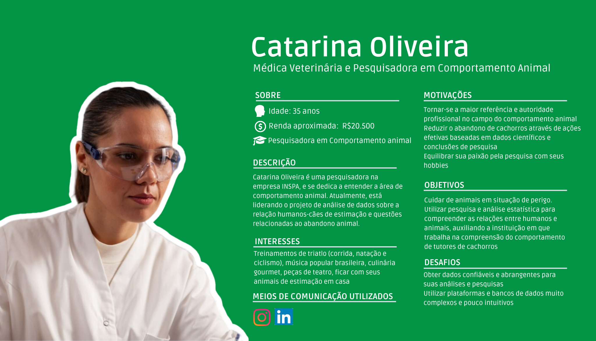
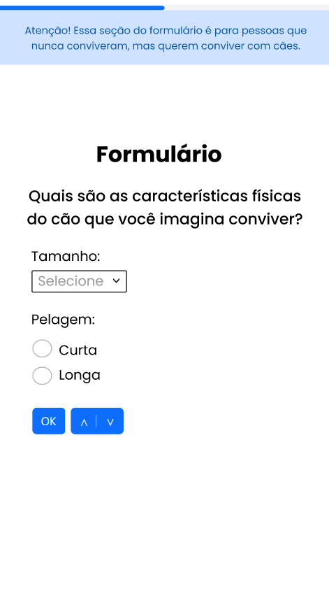

# WAD - *Web Application Document* - Módulo 2 - Inteli

## Patrulha Canina

#### <a href="https://www.linkedin.com/in/davi-abreu-da-silveira/">Davi Abreu da Silveira</a>

#### <a href="https://www.linkedin.com/in/felipe-zillo-72b367247/">Felipe Gutierres Zillo</a>

#### <a href="https://www.linkedin.com/in/j%C3%BAlia-alvesdejesus/">Júlia Alves de Jesus</a>

#### <a href="https://www.linkedin.com/in/mateus-martins-pretti-03ba952b4/">Mateus Martins Silveira Pretti</a>

#### <a href="https://www.linkedin.com/in/rafael-barbosa-b4386b293/">Rafael Rocha Barbosa</a>

#### <a href="https://www.linkedin.com/in/renan-reis-483a10289/">Renan Sabino dos Reis</a>

#### <a href="https://www.linkedin.com/in/sophia-emanuele-de-senne-silva/">Sophia Emanuele de Senne Silva</a>


## Sumário

[1. Introdução](#c1)

[2. Visão Geral da Aplicação Web](#c2)

[3. Projeto Técnico da Aplicação Web](#c3)

[4. Desenvolvimento da Aplicação Web](#c4)

[5. Testes da Aplicação Web](#c5)

[6. Conclusões e trabalhos futuros](#c6)

[7. Referências](#c7)

[8. Anexos](#c8)

<br>


# <a name="c1"></a>1. Introdução

&nbsp;&nbsp;&nbsp;&nbsp; A problemática central está na falta de dados e base científica relacionados às motivações para adoção/compra e abandono de animais. Nosso instituto parceiro se dedica a compreender essa questão para enfrentar o desafio maior do abandono, buscando reduzir esse índice. O projeto visa preencher essa lacuna no conhecimento científico e social sobre essas relações entre os seres humanos e animais de estimação, fornecendo uma base de dados confiável e abrangente. Para isso, estamos desenvolvendo uma aplicação *web* intuitiva e amigável, tanto em termos de usabilidade (*front-end*) quanto na coleta de informações, para os tutores (pesquisados) e também os pesquisadores do INSPA que farão uso dessas informações, proporcionando uma base de dados bem estruturada e de alta qualidade, gerando análises e visualizações dos motivos e comportamentos dos tutores respondentes.


# <a name="c2"></a>2. Visão Geral da Aplicação *Web*

## 2.1. Escopo do Projeto

### 2.1.1. Contexto da indústria

&nbsp;&nbsp;&nbsp;&nbsp;&nbsp;&nbsp; O INSPA - Instituto de Saúde e Psicologia Animal é pioneiro na área de cursos e programas de pós-graduação que mediam o bem-estar e a interação humano-animal no Brasil. A educação por meio de cursos de pós-graduação é uma estratégia de aprendizagem abrangente e aplicável a todos, visando resolver desafios na interação entre humanos e animais. [[1]](#7-referências) Em 2018, o INSPA foi responsável também pelo lançamento da primeira pós-graduação sobre Psicofarmacologia Veterinária, consolidando na prática o conceito de psiquiatria veterinária e consolidando-se no mercado. [[2]](#7-referências) O mercado PET gerou R$46,8 bilhões em receitas no ano de 2023, sendo R$10 bilhões provenientes de novos serviços pets, como por exemplo a venda de cursos que se deu início com o INSPA. [[1]](#7-referências) Nesse cenário de venda de cursos de pós-graduação há somente um concorrente em questão, que é o Instituto Qualitas, tendo uma abrangência nacional a eles. Entretanto, é um mercado em crescimento onde o INSPA teve um início promissor e ocupou uma lacuna que até 2011(ano de criação do INSPA)era muito pouco aparente.

### 2.1.2. Modelo de 5 Forças de Porter

&nbsp;&nbsp;&nbsp;&nbsp; Desenvolvido pelo professor da Harvard Business School Michael Porter, o Modelo das Cinco Forças de Porter é um modelo que analisa a competitividade de um setor industrial. Como o próprio nome já diz, existem 5 elementos importantes para essa análise: a rivalidade entre empresas do mesmo segmento, o poder de barganha dos fornecedores e dos clientes, a ameaça de produtos substitutos e a possibilidade de entrada de novos concorrentes. Esses fatores influenciam a dinâmica competitiva do setor,e com isso,  afetam  aspectos como a quantidade de clientes, preços, qualidade dos produtos, lucratividade das empresas, entre outros. 

&nbsp;&nbsp;&nbsp;&nbsp; A seguir temos a análise de 5 forças de Porter da empresa INSPA:

<div align="center">
<sub> Figura 1 - Análise 5 Forças de Porter </sub> <br>
	

	
<sup>Fonte: Material produzido pelos autores (2024)</sup>
</div>

&nbsp;&nbsp;&nbsp;&nbsp; Segue abaixo uma versão mais detalhada das 5 forças de Porter:

**Rivalidade entre os concorrentes existentes:** 

&nbsp;&nbsp;&nbsp;&nbsp; Existem diversos cursos de psicologia animal na internet, como os da FAMESP [[8]](#7-referências)(faculdade método de São Paulo) ou puc minas [[9]](#7-referências), outra a grande maioria é focada em cachorros, como a fitdog e a Educa Mundo. Dessa forma, existem muitos concorrentes que fazem coisas muito parecidas. Por isso, a rivalidade entre concorrentes é considerada alta.

**Ameaça de novos entrantes:** 

&nbsp;&nbsp;&nbsp;&nbsp; É necessário um estudo maior para criar uma empresa voltada para o mesmo fim, mas, pensando nos números de faculdades de zootecnia ou veterinária no Brasil, muitas pessoas já são capacitadas para desenvolver esse negócio. Por isso, é um mercado que pode trazer muitos concorrentes, então, a ameaça é alta.

**Poder de negociação dos fornecedores:**

&nbsp;&nbsp;&nbsp;&nbsp; Os fornecedores do INSPA podem variar de materiais de estudo, de gravação, ou até professores e editores. Os produtos são fornecidos por várias empresas. Pensando nos profissionais, segundo [[10]](#7-referências), mais de 11.000 médicos veterinários são formados por ano, e pela baixa demanda, o poder de barganha se concentra no INSPA. Por isso, o poder de barganha dos fornecedores é baixo.

**Ameaça de produtos ou serviços substitutos:**

&nbsp;&nbsp;&nbsp;&nbsp; Por ser um mercado bem definido, existem poucos produtos diferentes que podem se caracterizar como uma ameaça. Por esse motivo, a ameaça de concorrentes é baixa.

**Poder de barganha dos compradores:**

&nbsp;&nbsp;&nbsp;&nbsp; Como já supracitado, o INSPA possui alguns concorrentes, dessa forma, os compradores têm o poder de escolher dentre várias empresas, por isso, o poder barganha dos compradores é alto.


### 2.1.3. Análise SWOT

&nbsp;&nbsp;&nbsp;&nbsp; A análise SWOT do INSPA, Instituto de Saúde e Psicologia Animal, oferece uma visão estratégica abrangente do ambiente interno e externo desta instituição (figura 2). Ao examinar as forças, fraquezas, oportunidades e ameaças que moldam o seu contexto operacional, podemos identificar áreas-chave de vantagem competitiva e potenciais desafios. Esta análise serve como uma ferramenta fundamental para o INSPA na formulação de estratégias eficazes para maximizar seus pontos fortes, superar suas fraquezas, capitalizar oportunidades emergentes e mitigar ameaças futuras. 

### FORÇAS:

1. Reputação e pioneirismo.
    - O INSPA é reconhecido como pioneiro na área de saúde e psicologia animal, estabelecendo uma sólida reputação ao longo dos anos.

2. Ampla oferta educacional.
    - A empresa oferece uma variedade de cursos e programas de pós-graduação, demonstrando sua experiência e capacidade de atender às demandas do mercado.
    
2. Parcerias estratégicas.
    - A realização de parcerias com universidades renomadas para oferecer cursos de pós-graduação em Comportamento Animal amplia sua oferta educacional e credibilidade.

### FRAQUEZAS:

1. Limitação geográfica.
    - Embora tenha impacto nacional e internacional, o INSPA pode enfrentar desafios para alcançar regiões remotas ou menos desenvolvidas.

2. Falta de diversificação de serviços.
    - A empresa pode se tornar vulnerável se sua oferta educacional não se diversificar o suficiente para acompanhar as mudanças nas demandas do mercado.

3. Carência de colaboradores qualificados
    - A instituição pode enfrentar desafios na manutenção de um corpo docente de alto nível, o que pode impactar a qualidade do ensino oferecido.

### OPORTUNIDADES:

1. Crescente interesse em bem-estar animal
    - O aumento da conscientização sobre o bem-estar animal cria oportunidades para expandir a demanda por cursos e serviços oferecidos pelo INSPA.

2. Expansão internacional
    - A reputação estabelecida da empresa e seu compromisso com o desenvolvimento do campo podem facilitar a expansão para novos mercados internacionais.

3. Avanços tecnológicos
    - A integração de tecnologias educacionais pode abrir novas formas de entrega de cursos e programas, alcançando um público mais amplo e diversificado.

4. Demanda por serviços de consultoria especializada
    - A crescente conscientização sobre o bem-estar animal pode gerar uma demanda por serviços de consultoria especializada, como orientação comportamental e treinamento de tutores, oferecendo ao INSPA a oportunidade de expandir sua oferta além dos cursos tradicionais.

### AMEAÇAS:

1. Concorrência crescente
    - O aumento da concorrência de outras instituições educacionais e empresas no campo do bem-estar animal pode impactar a participação de mercado do INSPA.

2. Regulamentação
    - Mudanças nas regulamentações governamentais relacionadas ao ensino e prática em saúde animal podem afetar as operações da empresa.

3. Flutuações econômicas
    - Instabilidade econômica pode influenciar negativamente a capacidade dos clientes de investir em educação e serviços relacionados a animais.

4. Riscos tecnológicos
    - Dependência excessiva de plataformas tecnológicas pode expor a empresa a riscos relacionados à segurança de dados e interrupções no serviço.

<div align="center">
<sub>Figura 2 - Análise SWOT</sub>

<sup>Fonte: Material produzido pelos autores (2024)</sup>
</div>

### 2.1.4. Solução: 
&nbsp;&nbsp;&nbsp;&nbsp; A aplicação tem o objetivo de coletar dados dos donos de animais que adotaram, compraram ou abandonaram, pois faltam trabalhos científicos para abordar a problemática do abandono de animais sob uma perspectiva do comportamento humano e de fatores socioculturais. Como fonte, extraímos informações dos doze documentos disponibilizados pelo parceiro INSPA e da palestra proferida pelo líder executivo André de Almeida Prazeres Gonçalves.

&nbsp;&nbsp;&nbsp;&nbsp; A solução proposta é uma aplicação *web* voltada para a coleta de dados das pessoas por meio de formulários que serão respondidos por elas voluntariamente. Esses dados coletados serão armazenados em um banco de dados relacional e os administradores poderão acessá-los também por meio da aplicação para fácil visualização dos dados. Isso trará, em geral, para a empresa uma consolidação para a tomada de decisões estratégicas, que é a principal função da análise de dados, segundo [[3]](#7-referências).

&nbsp;&nbsp;&nbsp;&nbsp; O sucesso da aplicação será baseado na quantidade de formulários respondidos e na clareza com que os dados coletados estão sendo exibidos para os administradores, de modo a ajudá-los nas diversas tomadas de decisão dentro do instituto, levando a uma redução da taxa de abandono de animais no mundo.

### 2.1.5. Proposta de Valor

&nbsp;&nbsp;&nbsp;&nbsp; A proposta de valor, segundo [[4]](#7-referências) e [[5]](#7-referências), consiste em uma análise do consumidor que visa a compreender as dores, necessidades e desejos do cliente; dessa forma, o escopo dessa ferramenta é adequar a solução desenvolvida às demandas do público alvo. Nesse sentido, o canvas de proposta de valor (Figura 3) é a ferramenta visual para organização da análise feita. 


&nbsp;&nbsp;&nbsp;&nbsp; Primeiramente, faz-se uma análise do cliente, a fim de adequar o projeto às necessidades do cliente. Nessa etapa, avaliam-se quais as dores (_Pains_) dos clientes, isto é, qual a causa da contratação da solução. Outro ponto a ser analisado são os ganhos (_Gains_) que os clientes adquirirão com a solução apresentada; ademais, realiza-se uma análise das tarefas (_Costumer Jobs_) que o cliente tenta executar, mas demanda novas soluções. Em seguida, deve-se, com base nas conclusões sobre o cliente, propor uma solução em três fases: analgésicos (_Pain Relievers_), criadores de ganho (_Gain Creators_) e produtos e serviços (_Products and Services_). Os analgésicos representam como a solução aliviará as dores do cliente, enquanto os criadores de ganho são aspectos da solução capazes de entregar valor aos clientes e, por fim, em produtos e serviços, lista-se quais são as principais entregas a serem feitas, ou seja, qual a solução proposta de forma concisa.

<div align="center">
<sub>Figura 3 - Canvas da Proposta de Valor</sub>

<sup>Fonte: Material produzido pelos autores (2024)</sup>
</div>

&nbsp;&nbsp;&nbsp;&nbsp; Nesse sentido, a solução proposta busca agregar valor ao oferecer uma abordagem estruturada e eficiente para coletar e armazenar dados relevantes relacionados ao comportamento dos tutores e suas decisões em relação aos animais de estimação. Para cumprir esse objetivo, a aplicação *web* proporciona um formulário para a coleta de informações sobre o comportamento dos tutores em relação à adoção, compra e abandono de cães e uma base de dados para armazenar e organizar essas informações. Com esses dados, será possível analisar as condições que causam o abandono a fim de reduzir essa condição maléfica aos cães. Portanto, a construção de uma proposta de valor é fundamental para criação de um projeto voltado para as necessidades do cliente.

### 2.1.6. Matriz de Riscos

&nbsp;&nbsp;&nbsp;&nbsp; A matriz de riscos desempenha um papel crucial na gestão de projetos e no gerenciamento de riscos, sendo uma ferramenta visual que facilita a identificação, classificação e avaliação dos riscos e oportunidades em um projeto. Tipicamente, os riscos são organizados com base em sua probabilidade e impacto, oferecendo uma visão clara dos desafios principais que podem impactar o sucesso do projeto. Ao priorizar esforços de mitigação e desenvolver estratégias, as equipes de projeto podem lidar de forma eficaz com os riscos identificados. Em suma, a matriz de riscos é essencial para tomar decisões informadas e garantir que os projetos estejam prontos para enfrentar obstáculos ou aproveitar oportunidades (Figura 4).

<div align="center">
<sub>Figura 4 - Matriz de Risco</sub>

<sup>Fonte: Material produzido pelos autores (2024)</sup>
</div>

#### Riscos:

1. Problemas técnicos e problemas de saúde:
    - Análise da Vertente: Esses problemas podem surgir devido à falta de familiaridade da equipe com a as tecnologias que serão utilizadas no projeto e questões de saúde que podem afetar a produtividade.
    - Plano de Ação: Os membros da equipe podem oferecer ajuda e suporte uns aos outros nos conteúdos que serão passados em sala de aula, além de poderem consultar professores e monitores. No quesito da saúde, pode ser feito o gerenciamento das atividades dos membros que tiverem problemas de saúde ao longo do projeto, de forma à não prejudicar a equipe.

2. Tempo insuficiente:
    - Análise da Vertente: A falta de tempo pode resultar em entregas atrasadas ou incompletas devido a uma estimativa inadequada do tempo necessário para concluir as tarefas.
    - Plano de Ação: Realizar uma análise detalhada do cronograma do projeto, identificando as tarefas críticas e estimando realisticamente o tempo necessário para cada uma delas. Priorizar tarefas essenciais e revisar regularmente o progresso do projeto para garantir que o cronograma seja cumprido.

3. Segurança dos dados dos respondentes:
    - Análise da Vertente: A segurança dos dados é uma preocupação importante devido ao potencial impacto negativo de uma violação de dados na confiança dos usuários e na reputação da empresa.
    - Plano de Ação: Implementar medidas de segurança robustas, como criptografia de dados, controle de acesso e políticas de privacidade claras. Além disso, manter o time atualizado sobre as melhores práticas de proteção de dados, sempre pedindo ajuda aos professores, seria uma ótima prática.

4. Conformidade regulatória:
    - Análise da Vertente: O não cumprimento das regulamentações pode resultar em penalidades legais e danos à reputação da empresa.
    - Plano de Ação: Realizar uma análise das regulamentações aplicáveis, como a LGPD, e implementar políticas e procedimentos para garantir a conformidade. Ter o acompanhamento dos professores nesse ponto será essencial.

5. Falhas e bugs no código:
    - Análise da Vertente: Falhas e bugs no código podem comprometer a funcionalidade e usabilidade da aplicação.
    - Plano de Ação: Implementar práticas de desenvolvimento de software efetivas, como revisões de código, testes de unidade e integração contínua. Realizar testes extensivos de qualidade para identificar e corrigir falhas antes do lançamento da aplicação.

6. Erros de usabilidade e escopo mal interpretado:
    - Análise da Vertente: Erros de usabilidade podem surgir devido a uma interpretação inadequada dos requisitos do projeto.
    - Plano de Ação: Realizar uma análise detalhada dos requisitos do projeto, envolvendo os parceiros de projeto no processo de definição de requisitos sempre que possível, aproveitando-se das apresentações ao final de cada sprint. Realizar testes de usabilidade com usuários reais para identificar e corrigir problemas de usabilidade antes do lançamento da aplicação.

7. Ideias diferentes para tomada de decisão e comunicação ineficiente:
    - Análise da Vertente: Divergências de ideias e comunicação ineficaz podem resultar em conflitos e atrasos na tomada de decisões.
    - Plano de Ação: Estabelecer canais de comunicação claros e eficazes, promover uma cultura de colaboração e respeito mútuo.

#### Oportunidades:

1. Educação e conscientização da comunidade:
    - Análise da Vertente: A oportunidade de educar e conscientizar a comunidade pode resultar em uma mudança positiva de comportamento em relação ao abandono de animais de estimação.
    - Plano de Ação: Desenvolver, caso possível, ao final do formulário, uma página para levar o respondente a mais informações sobre o assunto do abando de cães, no sentido de conscientizá-lo.

2. Potencial de expansão da pesquisa no futuro:
    - Análise da Vertente: Os *insights* obtidos com a pesquisa podem servir como base para futuros estudos e investigações sobre o tema.
    - Plano de Ação: Fazer uma base de dados robusta que possa ser utilizada com facilidade no futuro e fazer um *site* agradável para atrair mais respostas para o formulário.

3. *Site* agradável visualmente que atraia mais respondentes:
    - Análise da Vertente: Um *site* visualmente atraente pode aumentar a participação na pesquisa e melhorar a representatividade dos dados coletados.
    - Plano de Ação: Investir em *design* de interface de usuário e experiência do usuário (UI/UX), utilizando elementos visuais atrativos e intuitivos para incentivar a participação na pesquisa.

4. Proposta bem apresentada para gerar respostas mais fidedignas:
    - Análise da Vertente: Uma proposta bem apresentada pode aumentar a credibilidade da pesquisa e incentivar respostas mais honestas e detalhadas dos respondentes.
    - Plano de Ação: Desenvolver uma proposta clara e persuasiva, destacando a importância e relevância da pesquisa, e fornecendo informações detalhadas sobre a metodologia e objetivos do estudo.

5. Reconhecimento do INSPA pela pesquisa:
    - Análise da Vertente: O sucesso da pesquisa pode aumentar o reconhecimento e a reputação do INSPA na área de estudos sobre comportamento animal.
    - Plano de Ação: Desenvolver a aplicação de forma a contribuir para que isso aconteça, trazendo uma base de dados robusta para a aplicação, um formulário que atraia mais respostas, entre outros.

6. Construção de uma comunidade ativa:
    - Análise da Vertente: O projeto oferece a oportunidade de construir uma comunidade ativa de tutores de animais de estimação interessados em contribuir para a pesquisa e compartilhar experiências.
    - Plano de Ação: Criar fóruns de discussão, grupos de apoio e eventos para envolver a comunidade, e incentivar a participação e interação entre os membros.

7. Esquema customer get customer para atrair respondentes:
    - Análise da Vertente: Implementar um esquema "customer get customer" pode aumentar o número de respondentes e melhorar a representatividade dos dados coletados.
    - Plano de Ação: Criar um programa de incentivo para os participantes existentes que indicarem novos respondentes, oferecendo recompensas ou benefícios para incentivar o engajamento e a participação na pesquisa.

&nbsp;&nbsp;&nbsp;&nbsp; Ao identificar e abordar esses riscos e oportunidades com planos de ação específicos, a equipe pode aumentar as chances de sucesso do projeto e alcançar seus objetivos de forma eficaz.

## 2.2. Personas

&nbsp;&nbsp;&nbsp;&nbsp; "Personas" são representações fictícias, mas realistas, de diferentes tipos de usuários de um produto, serviço ou sistema, criadas com base em dados reais e _insights_ sobre o público-alvo. Elas são utilizadas principalmente em desenvolvimento de produtos, e são feitas para ajudar as equipes a compreenderem melhor as necessidades, comportamentos, objetivos e desafios dos usuários.

&nbsp;&nbsp;&nbsp;&nbsp; Dessa forma, isso acontece porque *designers* e desenvolvedores (assim como as pessoas em geral) têm a tendência de serem cativados mais por instâncias concretas do que por abstrações e generalizações. É preciso que todos os membros da equipe de produtos tenham empatia com os usuários e estejam dispostos a dar o passo extra para desenvolver algo que funcione para os usuários reais. Mas se os utilizadores forem descritos em termos estatísticos e como perfis amplos, essa informação simplesmente não se alojará tão profundamente nos cérebros dos membros da equipe, e é ai que entra a persona.

&nbsp;&nbsp;&nbsp;&nbsp; Nesse sentido, desenvolvemos três personas que representam o nosso maior público alvo do projeto, sendo elas o(a) cientista (Catarina Oliveira - figura 5), a pessoa que já teve um animal e que tem a maior chance de abandonar (José Oliveira - figura 6) e a pessoa que tem um cachorro e que tem a menor chance de abandonar (Nathalia Freitas - figura 7).

<div align="center">
<sub>Figura 5 - Persona Catarina</sub>

<sup>Fonte: Material produzido pelos autores (2024)</sup>
</div>

<div align="center">
<sub>Figura 6 - Persona José</sub>

<sup>Fonte: Material produzido pelos autores (2024)</sup>
</div>

<div align="center">
<sub>Figura 7 - Persona Nathalia</sub>

<sup>Fonte: Material produzido pelos autores (2024)</sup>
</div>

&nbsp;&nbsp;&nbsp;&nbsp; De maneira resumida, falando um pouco mais desses "usuários" de nossa aplicação: Catarina é uma pesquisadora dedicada, liderando o projeto de análise de dados sobre a relação de cão-humano, ela ainda tem muitas motivações que a incentivem a fazer e seguir com tal pesquisa e objetivos claros que coincidem com os intuitos do projeto "abandono zero", sendo assim, um exemplo de pesquisador(a) ideal.

&nbsp;&nbsp;&nbsp;&nbsp; José, homem idoso, é um dos principais interesses do projeto, já que podemos analisar pela sua persona que ele já abandonou cães e tem características que explicitam isso. Assim, ele é uma persona ideal para traçar o perfil das pessoas que praticam esse tipo de atitude, o objetivo final e central de tal projeto.

&nbsp;&nbsp;&nbsp;&nbsp; Nathalia, com seu perfil praticamente "ideal", trará um bom norte ao projeto do oposto do que o José traz, que é o perfil de pessoas que são extremamente amigáveis e adoram animais, nesse caso, especialmente cães. Sendo assim, as métricas que ela trouxer para a pesquisa servirão de norte e exemplo de como uma pessoa com o perfil como o dela é, sendo importantíssima para se chegar à uma conclusão no final das pesquisas.

&nbsp;&nbsp;&nbsp;&nbsp; Por fim, todas essas personas serão essenciais e sublimes para se chegar à um resultado concreto ao final do projeto, sendo os melhores “exemplos” que podemos ter de usuários para a aplicação desenvolvida.

## 2.3. User Stories

&nbsp;&nbsp;&nbsp;&nbsp; O _User Stories_ é uma descrição detalhada de funcionalidades propostas pelo desenvolvedor. Após definir a funcionalidade a ser implementada, é necessário descrever um usuário e, além disso, pensar no que ele está tentando alcançar, suas ações e como ele se sentiu durante o processo. Em resumo, o User Stories é utilizado para detalhar a solução a ser desenvolvida e definir a melhor maneira de aplicá-la.

<div align="center">
<sub>Quadro 1 - User Stories 1</sub>

Identificação | US01
--- | ---
Persona | Nathalia Freitas
*User Story* | "Como uma psicóloga e mãe pet, quero fornecer minhas informações no formulário para contribuir com a pesquisa realizada"
Critério de aceite 1 | CR1: O *site* deve permitir que o usuário insira suas respostas para as questões do formulário. <br> Validação: O *site* deve coletar essas informações e armazená-las no banco de dados.
Critério de aceite 2 | CR1: O *site* deve permitir que o usuário passe ou volte uma pergunta. <br> Validação: O *site* apresenta a pergunta correspondente.
Teste de aceitação | CR1: Tentou passar para a próxima pergunta. <br> Aceitou = O *site* apresenta a próxima pergunta <br> Recusou = O usuário não clicou no botão correto.

<sup>Fonte: Material produzido pelos autores (2024)</sup>

</div>

<div align="center">

<sub>Quadro 2 - User stories 2</sub>

Identificação | US02
--- | ---
Persona | José Freitas
*User Story* | "Como um idoso, quero criar minha conta facilmente para ter acesso ao formulário"
Critério de aceite 1 | CR1: O *site* deve permitir que o usuário crie uma conta na plataforma. <br> Validação: O *site* deve fornecer uma tela de cadastro de dados e verificar se o usuário é um usuário comum.
Teste de aceitação | CR1: Preencheu suas informações de cadastro. <br> Aceitou = O *site* cria uma conta para o usuário, com acesso apenas ao *site* comum <br> Recusou = O usuário não preencheu todas as informações necessárias.

<sup>Fonte: Material produzido pelos autores (2024)</sup>

</div>

<div align="center">

<sub>Quadro 3 - User Stories 3</sub>

Identificação | US03
--- | ---
Persona | Catarina Oliveira
*User Story* | "Como pesquisadora em comportamento animal, quero acessar estatísticas sobre donos de cachorros para analisar possíveis soluções para o abandono exagerado de animais"
Critério de aceite 1 | CR1: O *site* deve apresentar uma tela específica para administradores <br> Validação: O *site* deve mostrar um relátorio sobre os dados coletados.
Teste de aceitação | CR1: Tentou acessar a página dos dados <br> Aceitou = O *site* apresenta os dados na tela <br> Recusou = O usuário não tem as permissões necessárias ou clicou no lugar errado..

<sup>Fonte: Material produzido pelos autores (2024)</sup>

</div>

<div align="center">

<sub>Quadro 4 - User stories 4</sub>

|Identificação|US04|
|---|---|
|Persona| José Oliveira |
|*User Story*|Eu como idoso quero preencher um formulário intuitivo e de fácil utilização para conseguir respondê-lo sem ajuda.|
|Critério de aceite 1|CR1: A aplicação deve possuir telas com as perguntas a serem respondidas.<br>Validação: A transição entre as perguntas deve possuir uma estrutura clara e lógica, com campos intuitivos.|
|Teste de aceitação|CR1: Apertou o botão para alterar a pergunta. <br>Aceitou = A aplicação mostrou a próxima pergunta e salvou a resposta anterior.<br>Recusou = A resposta anterior não foi preenchida.|

<sup>Fonte: Material produzido pelos autores (2024)</sup>

</div>

<div align="center">

<sub>Quadro 5 - User Stories 5</sub>

|Identificação|US05|
|---|---|
|Persona| Nathália Freitas|
|*User Story*| Eu como profissional quero fornecer meus dados apenas a lugares confiáveis para não usarem minhas informações de forma inadequada.|
|Critério de aceite 1|CR1: A aplicação deve fornecer informações claras sobre as parcerias e os propósitos para os quais os dados serão utilizados.<br> Validação: A aplicação possui uma tela com a descrição sobre o Inspa e o Alexandre Rossi.
|Teste de aceitação| CR1: Tentou acessar a tela “sobre” na barra de navegação.<br> Aceitou = A tela com a explicação dos idealizadores foi aberta. <br> Recusou = Clicou-se no lugar errado.|

<sup>Fonte: Material produzido pelos autores (2024)</sup>

</div>

<div align="center">

<sub>Quadro 6 - User stories 6</sub>

|Identificação|US06|
|---|---|
|Persona| Nathália Freitas|
|*User Story*| Eu como profissional e mãe quero saber porque preencher o formulário para não desperdiçar meu tempo.|
|Critério de aceite 1|CR1: A aplicação deve fornecer uma explicação clara e concisa sobre o propósito da coleta de dados, informando por que preenchê-lo. <br> Validação: A aplicação possui uma tela com a descrição sobre o projeto Abandono Zero.|
|Teste de aceitação| CR1: Tentou acessar a *home* na barra de navegação. <br>Aceitou = A tela com a explicação do projeto foi aberta. <br> Recusou = Clicou-se no lugar errado.|

<sup>Fonte: Material produzido pelos autores (2024)</sup>

</div>

<div align="center">

<sub>Quadro 7 - User stories 7</sub>

|Identificação|US07|
|---|---|
|Persona| Nathália Freitas|
|*User Story*| Eu como profissional e mãe quero poder preencher cada parte do formulário em um momento diferente para não ter que deixá-lo por falta de tempo com a rotina corrida.|
|Critério de aceite 1|CR1: Deve haver a opção de salvar o progresso e continuar posteriormente, permitindo que o profissional divida o preenchimento ao longo do tempo, conforme sua conveniência.<br> Validação: A cada transição de pergunta ocorre o salvamento da resposta.|
|Teste de aceitação| CR1: Clica-se no botão para avançar no formulário.<br>Aceitou = Avança-se para a próxima pergunta e a resposta da anterior é salva no banco de dados.<br>Recusou = A resposta anterior não foi preenchida.|

<sup>Fonte: Material produzido pelos autores (2024)</sup>

</div>


# <a name="c3"></a>3. Projeto da Aplicação *Web* 

## 3.1. Arquitetura

&nbsp;&nbsp;&nbsp;&nbsp; MVC é um padrão de arquitetura de _software_ que é dividida em 3 camadas:
 * _View_: É a camada de interação com usuário, tudo que o usuário consegue enxergar está presente nessa camada
*  _Controller_: É a camada de controle, ela é responsável por gerenciar a interação entre as outras duas camadas, aumentando a segurança do *site*
* _Model_: Camada de manipulação dos dados, controla a interação entre as outras camadas e o banco de dados
Ele está sendo utilizado pela facilidade de escalabilidade

&nbsp;&nbsp;&nbsp;&nbsp;Nos diagramas (Figuras 8 e 9), há outras duas camadas:
 * Rotas: representam os métodos HTTP e os caminhos de URL, seus valores correspondem aos controladores e ações que devem ser executados quando essas rotas são acessadas.
* _Services_: componentes que encapsulam a lógica de negócios que pode ser reutilizada em diferentes partes da aplicação.

<div align="center">
<sub>Figura 8 - MVC usuário</sub>

<sup>Fonte: Material produzido pelos autores(2024)</sup>

</div>

&nbsp;&nbsp;&nbsp;&nbsp; O MVC acima (Figura 8) realiza o fluxo de dados das *views* de cadastro, de *login*, do Formulário Resenha e do Formulário de Contatos para as respectivas entidades. Seus métodos agem sobre os dados recebidos do usuário a fim de atualizar o banco de dados.

<div align="center">
<sub>Figura 9 - MVC formulário</sub>

<sup>Fonte: Material produzido pelos autores(2024)</sup>
</div>

&nbsp;&nbsp;&nbsp;&nbsp; O MVC acima (Figura 9) realiza o fluxo de dados das *views* de formulário para as entidades correspondentes. Seus métodos são Listar, Gravar, Procurar e Deletar, os quais agem sobre os dados recebidos do usuário a fim de atualizar o banco de dados.

&nbsp;&nbsp;&nbsp;&nbsp;Os dados da aplicação serão armazenados em um Banco de Dados PostgreSQL, o qual será conectado à camada *Model* da arquitetura MVC, ao disponibilizar a essa camada os dados estruturados nela. Para que o usuário acesse a camada *View*, ele utilizará um *browser*, o que facilita o acesso, por ser uma ferramenta comumente disponível e por não precisar realizar a instalação de aplicações extras. Isso será disposto da seguinte forma:

- ### Modelos (*Models*):
<div align="center">
<sub>Quadro 8 - Entidades</sub>
</div>
<div align="center">

| Entidade | Descrição | Atributos |
| ------- | -------- | ------------|
| Users   | Armazena os dados essenciais para a realização do cadastro e a chave para o próximo formulário.    | ID, data de cadastramento, email, senha, data de nascimento, foreign key formulário |
| UserForms   | Armazena os dados do formulário inicial com os dados do usuário e a chave para qual será o formulário que ele irá responder em seguida.    | ID, nome, nome social, celular, país, estado/região, cidade, bairro, escolaridade, constituição familiar, faixa de renda familiar, tipo de moradia, número de moradores da casa, foreign key formulários|
|Contacts|Armazena as demais informações sobre o usuário, como meios de comunicação.|Nome, nome social, número de telefone etc.|
| Formulário 1 (presente)  | Armazena os dados correspondentes às perguntas feitas a quem possui cachorro.    | ID, Pergunta 1, Pergunta 2, ...|
| Formulário 2 (passado)   | Armazena os dados correspondentes às perguntas feitas a quem já teve algum cachorro.    | ID, Pergunta 1, Pergunta 2, ...|
| Formulário 3 (futuro) | Armazena os dados correspondentes às perguntas feitas a quem quer ter cachorro.    | ID, Pergunta 1, Pergunta 2, ...|
| Formulário 4 (null)  | Armazena os dados correspondentes às perguntas feitas a quem não tem e não quer ter cachorro.    | ID, Pergunta 1, Pergunta 2, ...|
|OtherPet|Armazena dados referente à pergunta de quantos outros animais há na casa.|Gatos, cachorros, outros|
|WhyDog|Armazena os dados referentes à pergunta sobre a razão pela qual adotou ou comprou o cachorro para o formulário presente.|Companhia para crianças, acompanhamento para adulto(s), por sua aparência, companhia para um cachorro que já morava na casa etc.|
|WhyHaveDog|Armazena os dados referentes à pergunta sobre a razão pela qual adotou ou comprou o cachorro para o formulário passado.|Companhia para crianças, acompanhamento para adulto(s), por sua aparência, companhia para um cachorro que já morava na casa etc.|

</div>
<div align="center">
<sup>Fonte: Material produzido pelos autores (2024)</sup>
</div>
<div align="center">

&nbsp;&nbsp;&nbsp;&nbsp;A entidade Usuários relaciona-se com a entidade Formulário 0, sendo que para um usuário pode haver várias respostas (é possível responder novamente após determinado período de tempo); portanto, as relações são 1:N. Ademais, a entidade Formulário 0 relaciona-se com as entidades Formulário 1, Formulário 2, Formulário 3 e Formulário 4, sendo que para cada vez que o Formulário 0 é preenchido é possível responder apenas uma vez a algum dos demais formulários; logo, a relação é 1:1.

- ### Controladores (*Controllers*):

<div align="center">
<sub>Quadro 9 - Controller</sub>
</div>

|*Controller*|Descrição|Métodos|
|---|---|---|
|&nbsp;&nbsp;&nbsp;&nbsp;Contacts|&nbsp;&nbsp;&nbsp;&nbsp;Realiza o fluxo de dados da *view* de formulário de contatos para a entidade Contact.|&nbsp;&nbsp;&nbsp;&nbsp;Create, update, list e getById.|
|&nbsp;&nbsp;&nbsp;&nbsp;Auth|&nbsp;&nbsp;&nbsp;&nbsp;Realiza o fluxo de dados das *views* de cadastro e de *login* para o Firebase.|&nbsp;&nbsp;&nbsp;&nbsp;EmailCadatro, emailLogin, forgotPassword e verifyLogin.|
|&nbsp;&nbsp;&nbsp;&nbsp;Users|&nbsp;&nbsp;&nbsp;&nbsp;Realiza o fluxo de dados das *views* de cadastro e de *login* para a entidade Usuários.|&nbsp;&nbsp;&nbsp;&nbsp;Create, update, getAll e getById.|
|&nbsp;&nbsp;&nbsp;&nbsp;UserForms|&nbsp;&nbsp;&nbsp;&nbsp;Realiza o fluxo de dados da *view* de formulário resenha para a entidade UserForm.|&nbsp;&nbsp;&nbsp;&nbsp;Create, update, getAll, getById, renderPage e showAllResponses.|
|&nbsp;&nbsp;&nbsp;&nbsp;HasDogForms|&nbsp;&nbsp;&nbsp;&nbsp;Realiza o fluxo de dados da *view* de formulário presente para a entidade HasDogForm.|&nbsp;&nbsp;&nbsp;&nbsp;Create, update, getAll e getById.|
|&nbsp;&nbsp;&nbsp;&nbsp;HadDogForms|&nbsp;&nbsp;&nbsp;&nbsp;Realiza o fluxo de dados da *view* de formulário passado para a entidade HadDogForm.|&nbsp;&nbsp;&nbsp;&nbsp;Create, update, getAll e getById.|
|&nbsp;&nbsp;&nbsp;&nbsp;NeverHadForms|&nbsp;&nbsp;&nbsp;&nbsp;Realiza o fluxo de dados da *view* de formulário futuro para a entidade NeverHadForm.|&nbsp;&nbsp;&nbsp;&nbsp;Create, update, list, delete e getById.|
|&nbsp;&nbsp;&nbsp;&nbsp;DontWantForms|&nbsp;&nbsp;&nbsp;&nbsp;Realiza o fluxo de dados da *view* de formulário null para a entidade DontWantForm.|&nbsp;&nbsp;&nbsp;&nbsp;Create, update e getAll.|
|&nbsp;&nbsp;&nbsp;&nbsp;OtherPets|&nbsp;&nbsp;&nbsp;&nbsp;Realiza o fluxo de dados referentes à pergunta sobre outros pets para a entidade OtherPet.|&nbsp;&nbsp;&nbsp;&nbsp;Create, update, list, delete e getById.|
|&nbsp;&nbsp;&nbsp;&nbsp;WhyDog|&nbsp;&nbsp;&nbsp;&nbsp;Realiza o fluxo de dados referentes à pergunta sobre o motivo da inclusão do cachorro para a entidade WhyDog.|&nbsp;&nbsp;&nbsp;&nbsp;Create, update, list, delete e getById.|
|&nbsp;&nbsp;&nbsp;&nbsp;WhyHaveDog|&nbsp;&nbsp;&nbsp;&nbsp;Realiza o fluxo de dados referentes à pergunta sobre o motivo da inclusão do cachorro para a entidade WhyHaveDog.|&nbsp;&nbsp;&nbsp;&nbsp;Create e getAll.|

</div>
<div align="center">
<sup>Fonte: Material produzido pelos autores (2024)</sup>
</div>

- ### *Views* (*Views*):

<div align="center">
<sub>Quadro 10 - Views</sub>
</div>

<div align="center">

| View | Função |
| ------- | -------- |
| *Homepage*   | Disponibiliza as informações sobre o projeto, além de um botão que direciona o usuário à tela de cadastro.    |
| *Login*   | Apresenta os campos a serem preenchidos pelo usuário a fim de acessar o formulário no status correto para ele.    | 
| Cadastrar-se   | Apresenta os campos a serem preenchidos para a criação de um novo usuário.    | 
| Tela Administrador   | Tela em que são dispostos alguns dos dados e onde é possível baixá-los em sua totalidade ou em partes.     | 
| Formulário 0, Formulário 1, Formulário 2, Formulário 3, Formulário 4    | Possui os enunciados e os campos para respostas das perguntas do questionário.    | 

</div>

<div align="center">
<sup>Fonte: Material produzido pelos autores (2024)</sup>
</div>

&nbsp;&nbsp;&nbsp;&nbsp;Dessa forma, toda a estrutura do *site* está completa, sendo possível imaginar como toda a interação entre as camadas funcionarão. Com isso, é mais fácil de desenvolver o código da aplicação.

## 3.2. *Wireframes*
&nbsp;&nbsp;&nbsp;&nbsp; *Wireframe*, segundo [[7]](#7-referências), é um esboço simples - sem cores, fontes, ícones e imagens - de telas de produtos sociais. Dessa forma, consegue-se demonstrar a arquitetura de uma interface com a posição dos elementos; logo, o objetivo é estruturar e validar ideias com o cliente. Nesse cenário, o _wireframe_ do projeto (Figuras 10 a 31) foi elaborado com o objetivo de cumprir os requisitos do projeto e as *user stories*. Para melhor visualização, ele pode ser acessado [aqui](https://www.figma.com/file/MNWwRggRjwBb5KCBfIvPd8/AbandonoZero?type=design&node-id=6-15&mode=design&t=EE9sqPCdfv7ZPoA1-0).

<div align="center">
<sub>Figura 10 - Wireframe da Homepage</sub> <br>

<sup>Fonte: Material produzido pelos autores (2024)</sup>
</div>

&nbsp;&nbsp;&nbsp;&nbsp; Essa disposição da tela inicial (Figura 10) facilita a navegação e fornece informações diretas para os usuários e também informações avançadas que podem ser encontradas ao clicar no botão no canto superior esquerdo. Começa com um carrossel de imagens para mostrar cachorros resgatados da situação de abandono e contextualizar o público alvo do projeto “Abandono Zero” direitos, seguidos por outra contextualização só que verbal dessa vez por meio do “Sobre”. Por fim, o botão de “Responder” com uma borda que seja intuitiva e chame a atenção do usuário para responder o formulário, que é o principal objetivo deste *site*.

<div align="center">
<sub>Figura 11 - Wireframe da barra de navegação</sub>

<sup>Fonte: Material produzido pelos autores (2024)</sup>
</div>

&nbsp;&nbsp;&nbsp;&nbsp; Essa página (Figura 11) abre ao clicar no botão do canto superior esquerdo da tela inicial e facilita encontrar informações específicas como: *Home*, Sobre, Contato, Cadastrar-se e Entrar. O botão de “Entrar” possui um destaque a mais para que as pessoas que já possuem conta no *site* se atentem e não acabem criando outra conta, perdendo tempo e consequentemente o interesse por responder o formulário. Ao visualizar o que queria e desejar fechar essa aba o usuário pode sair clicando no botão “X”.

<div align="center">
<sub>Figura 12 - Wireframe da tela de login</sub>

<sup>Fonte: Material produzido pelos autores (2024)</sup>
</div>

&nbsp;&nbsp;&nbsp;&nbsp; Essa tela (Figura 12) contém dois campos de texto que o usuário deverá digitar seu email e sua senha para efetuar o *login*, ao preencher os dois campos você clica no botão “Entrar” e será redirecionado ao *site* só que com sua conta logada e assim permitido a realizar o formulário. Além desses elementos, possui uma imagem de um cachorro para ser mais “divertido” que ao clicar para preencher o campo “Senha” ele fecha o olho para dar ideia de privacidade ao usuário.

<div align="center">
<sub>Figura 13 - Wireframe da tela de cadastro</sub>

<sup>Fonte: Material produzido pelos autores (2024)</sup>
</div>

&nbsp;&nbsp;&nbsp;&nbsp; A tela de cadastro (Figura 13) segue o mesmo padrão de funcionamento da tela de *login*, as únicas diferenças são o botão de “Cadastrar” no lugar do botão de “Entrar” já que é um processo diferente onde o usuário ainda não possui uma conta para entrar diretamente, por esse mesmo motivo essa tela possui um campo de texto a mais para confirmar a senha logo após o campo “Senha”, já que o usuário está criando-a agora. Demais elementos também estão presentes na tela de *login* e foram escolhidos para trazer intuitividade, “diversão” e direção ao usuário.

<div align="center">
<sub>Figura 14 - Wireframe da tela de descrição dos idealizadores</sub>

<sup>Fonte: Material produzido pelos autores (2024)</sup>
</div>

&nbsp;&nbsp;&nbsp;&nbsp; O campo “Sobre” (Figura 14) possui informações que o usuário que está acessando o *site* pode acabar se interessando como por exemplo: Informações sobre o INSPA, informações sobre parceiros do projeto Abandono Zero e etc. Contendo juntamente dessas informações imagens para tornar a experiência do usuário mais agradável e contextualizada não verbalmente também. Logo abaixo contém algumas informações presentes no rodapé como mídias sociais para que o usuário possa ajudar com o engajamento do projeto, além de outros *links* de acesso rápido que podem ajudar o entendimento do mesmo a respeito do projeto, INSPA e etc.

<div align="center">
<sub>Figura 15 - Wireframe da tela de cadastro</sub>

<sup>Fonte: Material produzido pelos autores (2024)</sup>
</div>

&nbsp;&nbsp;&nbsp;&nbsp;Essa disposição da tela inicial facilita a navegação e fornece informações diretas para os usuários e também informações avançadas que podem ser encontradas ao clicar no botão no canto superior esquerdo. Começa com um carrossel de imagens para mostrar cachorros resgatados da situação de abandono e contextualizar o público alvo do projeto “Abandono Zero” direitos, seguidos por outra contextualização só que verbal dessa vez por meio do “Sobre”. Por fim, o botão de “Responder” com uma borda que seja intuitiva e chame a atenção do usuário para responder o formulário, que é o principal objetivo deste *site*.

<div align="center">
<sub>Figura 16 - Wireframe da tela de formulário de cadastro</sub>

<sup>Fonte: Material produzido pelos autores (2024)</sup>
</div>

&nbsp;&nbsp;&nbsp;&nbsp;Essa página abre ao clicar no botão do canto superior esquerdo da tela inicial e facilita encontrar informações específicas como: *Home*, Sobre, Contato, Cadastrar-se e Entrar. O botão de “Entrar” possui um destaque a mais para que as pessoas que já possuem conta no *site* se atentem e não acabem criando outra conta, perdendo tempo e consequentemente o interesse por responder o formulário. Ao visualizar o que queria e desejar fechar essa aba o usuário pode sair clicando no botão “X”.

<div align="center">
<sub>Figura 17 - Wireframe da tela do questionário</sub>

<sup>Fonte: Material produzido pelos autores (2024)</sup>
</div>

&nbsp;&nbsp;&nbsp;&nbsp;Essa tela contém dois campos de texto que o usuário deverá digitar seu email e sua senha para efetuar o *login*, ao preencher os dois campos você clica no botão “Entrar” e será redirecionado ao *site* só que com sua conta logada e assim permitido a realizar o formulário. Além desses elementos, possui uma imagem de um cachorro para ser mais “divertido” que ao clicar para preencher o campo “Senha” ele fecha o olho para dar ideia de privacidade ao usuário.

<div align="center">
<sub>Figura 18 - Wireframe da tela do questionário</sub>

<sup>Fonte: Material produzido pelos autores (2024)</sup>
</div>

&nbsp;&nbsp;&nbsp;&nbsp; Essa parte do *site* (Figuras 15 a 18) é bem _clean_, ou seja, com poucos elementos. Ela foi organizada dessa forma tomando como inspiração o *site* de formulários “_Typeform_”, que é utilizado em diversas empresas grandes. Ele foi utilizado justamente por ser um case de formulário que os respondentes têm um engajamento grande em relação a diversos outros formulários, que são considerados menos agradáveis de serem respondidos. Dessa forma, os elementos citados acima, apesar de poucos, serão bem trabalhados, de forma a deixar o *site* fluido e com boa usabilidade. Pensando agora mais nos elementos em si, os textos das questões foram colocados na parte superior esquerda justamente para ser a primeira coisa que o usuário verá, pensando no fato de que nós lemos de cima para baixo e da esquerda para a direita, então nossos olhos estão “treinados” para olhar para essa direção. Os botões para voltar estão na posição que estão (canto inferior direito) justamente para não terem muita atenção do usuário, que só usará eles caso realmente precise. Os botões de opção e ok devem ficar logo abaixo das questões e respostas, respectivamente, para ser o elemento que o usuário verá logo após ver a pergunta ou responder a pergunta, sendo assim, poupando tempo dele para procurá-los pela tela do *site*.

 &nbsp;&nbsp;&nbsp;&nbsp;Por fim, as imagens estão no *site* para deixar tudo mais dinâmico, podendo, por exemplo, utilizar o espaço para colocar fotos de cachorrinhos, por exemplo. Elas ficam na parte de baixo pois não são muito importantes.

&nbsp;&nbsp;&nbsp;&nbsp;Dessa forma, essa disposição faz com que o usuário tenha que pensar menos para utilizar o *site*, assim deixa sua utilização mais rápida, garantindo mais respostas para o formulário, que é o principal intuito.

<div align="center">
<sub>Figura 19 - Wireframe da tela visível ao administrador</sub>

<sup>Fonte: Material produzido pelos autores (2024)</sup>
</div>

&nbsp;&nbsp;&nbsp;&nbsp;Essa tela (Figura 19) segue a proposta minimalista das demais telas enquanto apresenta os contatos relacionados ao projeto.

<div align="center">
<sub>Figura 20 - Wireframe da tela visível ao administrador</sub>

<sup>Fonte: Material produzido pelos autores (2024)</sup>
</div>

&nbsp;&nbsp;&nbsp;&nbsp;A tela de cadastro segue o mesmo padrão de funcionamento da tela de *login*, as únicas diferenças são o botão de “Cadastrar” no lugar do botão de “Entrar” já que é um processo diferente onde o usuário ainda não possui uma conta para entrar diretamente, por esse mesmo motivo essa tela possui um campo de texto a mais para confirmar a senha logo após o campo “Senha”, já que o usuário está criando-a agora. Demais elementos também estão presentes na tela de *login* e foram escolhidos para trazer intuitividade, “diversão” e direção ao usuário.

<div align="center">
<sub>Figura 21 - Wireframe da tela visível ao administrador</sub>

<sup>Fonte: Material produzido pelos autores (2024)</sup>
</div>

&nbsp;&nbsp;&nbsp;&nbsp; Essas telas (Figuras 20 e 21) é responsável por passar as informações sobre a pesquisa para o pesquisador, por isso, ela traz o mínimo de informações possível. Dessa forma, a facilidade de entendimento dos dados aumenta. Uma barra lateral é disposta para o usuário ter acesso à algumas páginas informativas, o relatório é elaborado pela equipe e é o foco principal do projeto, além disso, o pesquisador tem acesso às tabelas de dados de cada usuário e, para facilitar a leitura, terá a opção de filtrar algumas informações. Ao fim, ele terá a opção de baixar esses dados para eventuais necessidades.

&nbsp;&nbsp;&nbsp;&nbsp; Para *desktop* (Figuras 22 a 31), ao invés da barra lateral, foi colocada uma barra superior para facilitar o acesso às demais páginas; além disso, as imagens e os textos foram reposicionados e redimensionados a fim de ficarem adequados ao formato da tela.

<div align="center">
<sub>Figura 22 - Wireframe da homepage e da tela de descrição dos idealizadores</sub>

<sup>Fonte: Material produzido pelos autores (2024)</sup>
</div>

&nbsp;&nbsp;&nbsp;&nbsp; Este é o rodapé do nosso *site* (Figura 22), onde você pode encontrar algumas informações úteis. Essa disposição do rodapé segue uma lógica que facilita a navegação e fornece informações importantes para os usuários. Começando com os direitos autorais e os termos de uso, seguidos pela política de privacidade, mostra a preocupação com a legalidade e a transparência. As mídias sociais são colocadas em destaque para promover a interação e o engajamento com a comunidade do projeto. Os outros *links* fornecem acesso rápido a outras seções relevantes do *site*, enquanto a opção de escolha de idioma atende à diversidade de usuários.

<div align="center">
<sub>Figura 23 - Wireframe da tela de login</sub>

<sup>Fonte: Material produzido pelos autores (2024)</sup>
</div>

&nbsp;&nbsp;&nbsp;&nbsp;O campo “Sobre” possui informações que o usuário que está acessando o *site* pode acabar se interessando como por exemplo: Informações sobre o INSPA, informações sobre parceiros do projeto Abandono Zero e etc. Contendo juntamente dessas informações imagens para tornar a experiência do usuário mais agradável e contextualizada não verbalmente também. Logo abaixo contém algumas informações presentes no rodapé como mídias sociais para que o usuário possa ajudar com o engajamento do projeto, além de outros *links* de acesso rápido que podem ajudar o entendimento do mesmo a respeito do projeto, INSPA e etc.

<div align="center">
<sub>Figura 24 - Wireframe da tela de cadastro</sub>

<sup>Fonte: Material produzido pelos autores (2024)</sup>
</div>

&nbsp;&nbsp;&nbsp;&nbsp;Essa parte do *site* é bem *clean*, ou seja, com poucos elementos. Ela foi organizada dessa forma tomando como inspiração o *site* de formulários “Typeform”, que é utilizado em diversas empresas grandes. Ele foi utilizado justamente por ser um case de formulário que os respondentes têm um engajamento grande em relação a diversos outros formulários, que são considerados menos agradáveis de serem respondidos. 

&nbsp;&nbsp;&nbsp;&nbsp;Dessa maneira, os elementos citados acima, apesar de poucos, serão bem trabalhados, de forma a deixar o *site* fluido e com boa usabilidade. Pensando agora mais nos elementos em si, os textos das questões foram colocados na parte superior esquerda justamente para ser a primeira coisa que o usuário verá, pensando no fato de que nós lemos de cima para baixo e da esquerda para a direita, então nossos olhos estão “treinados” para olhar para essa direção. 

&nbsp;&nbsp;&nbsp;&nbsp;Os botões para voltar estão na posição que estão (canto inferior direito) justamente para não terem muita atenção do usuário, que só usará eles caso realmente precise. Os botões de opção e ok devem ficar logo abaixo das questões e respostas, respectivamente, para ser o elemento que o usuário verá logo após ver a pergunta ou responder a pergunta, sendo assim, poupando tempo dele para procurá-los pela tela do *site*. Por fim, as imagens estão no *site* para deixar tudo mais dinâmico, podendo, por exemplo, utilizar o espaço para colocar fotos de cachorrinhos, por exemplo. Elas ficam na parte de baixo pois não são muito importantes.

&nbsp;&nbsp;&nbsp;&nbsp;Dessa forma, essa disposição faz com que o usuário tenha que pensar menos para utilizar o *site*, assim deixa sua utilização mais rápida, garantindo mais respostas para o formulário, que é o principal intuito.

<div align="center">
<sub>Figura 25 - Wireframe </sub>

<sup>Fonte: Material produzido pelos autores (2024)</sup>
</div>

&nbsp;&nbsp;&nbsp;&nbsp;Essa tela é responsável por passar as informações sobre a pesquisa para o pesquisador, por isso, ela traz o mínimo de informações possível. Dessa forma, a facilidade de entendimento dos dados aumenta. Uma barra lateral é disposta para o usuário ter acesso à algumas páginas informativas, o relatório é elaborado pela equipe e é o foco principal do projeto, além disso, o pesquisador tem acesso às tabelas de dados de cada usuário e, para facilitar a leitura, terá a opção de filtrar algumas informações. Ao fim, ele terá a opção de baixar esses dados para eventuais necessidades.


<div align="center">
<sub>Figura 26 - Wireframe do formulário de cadastro</sub>

<sup>Fonte: Material produzido pelos autores (2024)</sup>
</div>

&nbsp;&nbsp;&nbsp;&nbsp;Para *desktop*, ao invés da barra lateral, foi colocada uma barra superior para facilitar o acesso às demais páginas; além disso, as imagens e os textos foram reposicionados e redimensionados a fim de ficarem adequados ao formato da tela.

<div align="center">
<sub>Figura 27 - Wireframe da tela do questionário</sub>

<sup>Fonte: Material produzido pelos autores (2024)</sup>
</div>

&nbsp;&nbsp;&nbsp;&nbsp;Este é o rodapé do nosso *site*, onde você pode encontrar algumas informações úteis. Essa disposição do rodapé segue uma lógica que facilita a navegação e fornece informações importantes para os usuários. Começando com os direitos autorais e os termos de uso, seguidos pela política de privacidade, mostra a preocupação com a legalidade e a transparência. As mídias sociais são colocadas em destaque para promover a interação e o engajamento com a comunidade do projeto. Os outros *links* fornecem acesso rápido a outras seções relevantes do *site*, enquanto a opção de escolha de idioma atende à diversidade de usuários.


<div align="center">
<sub>Figura 28 - Wireframe da tela do questionário</sub>

<sup>Fonte: Material produzido pelos autores (2024)</sup>
</div>

<div align="center">
<sub>Figura 29 - Wireframe da tela do administrador</sub>

<sup>Fonte: Material produzido pelos autores (2024)</sup>
</div>

<div align="center">
<sub>Figura 30 - Wireframe da tela do administrador</sub>

<sup>Fonte: Material produzido pelos autores (2024)</sup>
</div>

<div align="center">
<sub>Figura 31 - Wireframe da tela de Contatos</sub>

<sup>Fonte: Material produzido pelos autores (2024)</sup>
</div>

&nbsp;&nbsp;&nbsp;&nbsp; Na Figura 22, tem-se o esboço da tela do formulário, a qual terá as perguntas, o espaço para as respostas e botões que permitem transitar entre as perguntas; dessa forma a _User Story_ 1. Na tela representada na Figura 24, será possível realizar o cadastro para criar uma conta na plataforma e, assim, obter acesso ao questionário; portanto, a _User Story_ 2 também é atendida. Ainda, a tela visível na Figura 26 poderá ser acessada pelos usuários administradores e disporá alguns dos dados coletados no formulário e possibilitará o *download* de todos os dados; solucionando a _User Story_ 3.

&nbsp;&nbsp;&nbsp;&nbsp; Portanto, por meio do _wireframe_ é possível demonstrar as informações e elementos da interface de forma simples e prática; logo, consegue-se compreender diversos aspectos do projeto a fim de criar uma interface intuitiva para o usuário que cumpra sua proposta de negócio e passe a mensagem correta de forma assertiva.

## 3.3. Guia de estilos

&nbsp;&nbsp;&nbsp;&nbsp;Um guia de estilos, segundo [[18]](#7-referências-sprints-1-a-5), é um conjunto de diretrizes de *design* que definem como um determinado produto, projeto ou marca deve ser apresentado. Ele é usado para garantir consistência e coesão em projetos, comunicações e produtos. Assim, o guia não é apenas um conjunto de diretrizes estáticas, mas sim um recurso dinâmico que orienta o processo de *design* em todas as etapas do projeto. Portanto, deve-se usar os elementos do Guia de Estilos para todo o desenvolvimento do projeto, a fim de garantir a consistência entre as diversas interfaces. Dessa forma, deve-se utilizar cores, fontes, ícones e imagens presentes nesta seção de acordo com a inteção na construção de cada interface e com a descrição aqui documentada.

### 3.3.1 Cores

&nbsp;&nbsp;&nbsp;&nbsp;No mundo do *design*, as cores desempenham um papel fundamental na criação de uma experiência visual cativante e impactante para os usuários. Cada cor carrega consigo significados e emoções distintas, capazes de influenciar a percepção e a resposta emocional dos visitantes do nosso *site*. Ao escolher cuidadosamente uma paleta de cores, como as que foram selecionadas a seguir (Figura 32), é possível criar uma atmosfera única e transmitir mensagens específicas, essenciais para o sucesso do *design* de um *site*.

**Alice Blue | #D9F0FF | rgb(217, 240, 255)**

&nbsp;&nbsp;&nbsp;&nbsp; Essa cor foi escolhida, pois é uma cor suave e refrescante, frequentemente associada à tranquilidade e à pureza. Pode transmitir uma sensação de calma e serenidade aos visitantes do seu *site*, criando uma atmosfera acolhedora e relaxante. Sendo também, parecida com o branco.

**Light Sky Blue | #A3D5FF | rgb(163, 213, 255)**

&nbsp;&nbsp;&nbsp;&nbsp; O azul claro do céu é frequentemente relacionado à paz e à serenidade. Essa cor pode prococar uma sensação de espaço aberto e liberdade, criando uma atmosfera agradável no *site*.

**Light Sky Blue | #83C9F4 | rgb(131, 201, 244)**

&nbsp;&nbsp;&nbsp;&nbsp; Essa cor também está relacionada com o céu, sendo usada para criar uma sensação de expansão e claridade, proporcionando uma experiência visual agradável aos usuários.

**Medium slate blue | #6F73D2 | rgb(111, 115, 210)**

&nbsp;&nbsp;&nbsp;&nbsp; Este tom de azul é mais profundo e sólido, transmitindo uma sensação de estabilidade e confiança. Sendo utilizado para fornecer contraste ou como cor de destaque em nosso *site*, adicionando uma sensação de solidez e profundidade ao *design*.

**Glaucous | #7681B3 | rgb(118, 129, 179)**

&nbsp;&nbsp;&nbsp;&nbsp; O glaucous é um azul esverdeado que pode evocar uma sensação de mistério e tranquilidade. Essa cor única pode adicionar profundidade e interesse visual ao seu *site*, criando um espaço intrigante e cativante para os visitantes.

<div align="center">
<sub>Figura 32 - Paleta de cores</sub>

<sup>Fonte: Material produzido pelos autores (2024)</sup>
</div>

### 3.3.2 Tipografia

&nbsp;&nbsp;&nbsp;&nbsp; A tipografia desempenha um papel fundamental na experiência do usuário em um *site*. Ela não apenas comunica o conteúdo textual, mas também influencia a legibilidade, a acessibilidade e a estética geral da página. A escolha da fonte certa pode transmitir a personalidade da marca, estabelecer a hierarquia visual do conteúdo e até mesmo influenciar as emoções dos visitantes.

&nbsp;&nbsp;&nbsp;&nbsp; Para os textos de nosso *site* utilizaremos a fonte <b>Roboto</b>[[11]](#7-referências) (Figura 33). Roboto é uma fonte sans-serif amplamente utilizada devido à sua legibilidade e versatilidade. Ela é limpa, moderna e fácil de ler em diferentes tamanhos e dispositivos, o que a torna uma escolha sólida para o corpo do texto do *site*. Assim, garantindo uma leitura confortável para os visitantes.

<div align="center">
<sub>Figura 33 - Roboto</sub>

<sup>Fonte: Material produzido pelos autores (2024)</sup>
</div>

&nbsp;&nbsp;&nbsp;&nbsp; Já para os títulos e destaques do *site*, usaremos a fonte <b>Cabin</b>[[12]](#7-referências) (Figura 34). A Cabin é uma fonte serifada com uma personalidade amigável e elegante. As serifas adicionam um toque de sofisticação aos títulos, criando uma distinção visual entre o texto principal e os cabeçalhos. Usar esta fonte para os títulos pode ajudar a atrair a atenção dos usuários e destacar as seções importantes do *site*. Alem de que, uma combinação de uma fonte serifada para títulos com uma fonte sans-serif para o texto principal cria um contraste visual agradável.

<div align="center">
<sub>Figura 34 - Cabin</sub>

<sup>Fonte: Material produzido pelos autores (2024)</sup>
</div>

&nbsp;&nbsp;&nbsp;&nbsp; Por fim, para as perguntas dos formulários, escolhemos a fonte <b>Poppins</b>[[13]](#7-referências) (Figura 35). Poppins é uma fonte sans-serif moderna e geométrica, muito conhecida por sua aparência amigável e contemporânea. Sendo ideal para destacar as perguntas, pois sua forma arredondada e limpa mantém legível e atraente. A fonte adiciona um toque de modernidade e coerência visual ao *design* do formulário, contribuindo para uma experiência de usuário mais intuitiva.

<div align="center">
<sub>Figura 35 - Poppins</sub>

<sup>Fonte: Material produzido pelos autores (2024)</sup>
</div>

### 3.3.3 Iconografia e imagens 

&nbsp;&nbsp;&nbsp;&nbsp; Ícones são elementos visuais que ficam na interface do usuário. Eles representam objetos, ações, por meio de pequenas imagens. Eles são muito importantes pois agregam na usabilidade, acessibilidade e experiência do usuário em *sites* e *apps*, facilitando a comunicação entre o usuário e a interface.

&nbsp;&nbsp;&nbsp;&nbsp; Os ícones têm várias funções em uma interface, como agregar e facilitar a compreensão. Eles ajudam os usuários a entender a função de um elemento em uma interface, sem ter que ler textos. Isso também agrega na otimização do espaço, já que eles são simples e pequenos, assim ocupam menos espaço e fazem com que alguns textos (que também ocupam espaço) sejam dispensáveis. Isso permite uma melhor utilização da interface, por exemplo.

&nbsp;&nbsp;&nbsp;&nbsp; Ainda podemos citar a maior facilidade na navegação, auxiliado os usuários na orientação e movimentação pela interface, tornando a experiência de navegação mais intuitiva e direta e também o *design* estético, que podem torná-la mais atraente e agradável aos olhos.

<div align="center">
<sub>Quadro 11 - Iconografia</sub>

| Ícones | Descrição |
| ------- | -------- |
|    | A figura ao lado representa um ícone de placa de proibido parar, ele será utilizado para indicar que o usuário não pode passar para uma próxima pergunta do formulário quando a que ele estiver respondendo é uma pergunta obrigatória. |
|    | A figura ao lado representa um ícone de uma seta apontando para dentro de uma caixa. Ele será utilizado para indicar o botão de login/cadastre-se, dando a entender que é o botão para entrar no formulário.   | 
|    | A figura ao lado representa um ícone de texto em uma caixa, ela será utilizada para indicar um botão que levará para a seção sobre do *site*, indicando que essa seção contêm um texto falando mais sobre o projeto.   | 
|    |  A figura ao lado representa um ícone de *download*, ela será utilizada na área do pesquisador para ele poder fazer *download* das informações que ele deseja do banco de dados, não precisando de texto e deixando a interface mais _clean_.   | 
|    | A figura ao lado representa um ícone do Facebook. Ele ficará no rodapé do *site* para indicar a rede social do projeto em tal *site* caso o usuário queira acompanhar ele mais de perto.   | 
|  | A figura ao lado representa um ícone de barras, com as barras se afinando. Esse ícone é muito utilizado como filtro, e ficará na parte do pesquisador para poder filtrar os dados que ele quer visualizar do banco de dados. | 
|    | A figura ao lado representa um ícone de localização. Ele ficará no formulário para indicar quando o usuário estiver preenchendo a seção de localização deste.| 
|    | A figura ao lado representa um ícone de globo, ele ficará no header do *site* para indicar que é possível mudar de lingua, assim permitindo atingir mais pessoas de diferentes países com o projeto. | 
|    | A figura ao lado representa um ícone de casa, ele ficará ao lado do botão para acessar a aba home do *site*, indicando assim que aquele botão levará o usuário para a "home". | 
|  | A figura ao lado representa um ícone de informações, ele ficará no rodapé do *site* para levar o usuário para uma aba que ele possa ver mais informações do projeto. | 
|  |  A figura ao lado representa um ícone de instagram. Ele terá a mesma função do que o ícone de Facebook.| 
|  | A figura ao lado representa um ícone de lista. Ele é comumente utilizado para aplicações no celular, onde ele fica em algum dos cantos superiores para abrir a aba de seções daquele *site*. Ele servirá para esse intuito em nosso *site*. | 
|  | A figura ao lado representa um ícone de pessoa. Ele servirá para que o usuário acesse o seu perfil, e mude alguma das informações de log in no *site* caso precise/deseje. | 
|  | A figura ao lado representa um ícone de lupa. Ele é comumente utilizado para que o usuário faça pesquisas por abas no *site*. Ele será utilizado na área do pesquisador para que ele pesquise filtros ou informações que ele quer filtrar do banco de dados. | 
|  |  A figura ao lado representa um ícone de compartilhamento. Ele será utilizado para que os usuários consigam compartilhar a aplicação com outras pessoas e assim disseminem mais o formulário, assim permitindo uma maior captura de dados e informações das pessoas em relação aos seus cães. | 
|  | A figura ao lado representa um ícone de telefone, ele será utilizado para mostar um número de suporte/contato que o usuário pode entrar caso ele tenha dúvidas daquela aplicação. | 
|  | A figura ao lado representa um ícone de lixo. Ele será utilizado dentro da área do usuário para indicar que ele pode deletar sua conta caso ele deseje tal. | 
|  | A figura ao lado representa um ícone de whatsapp. Ele será utilizado para indicar que o usuário pode entrar me contato com as pessoas por trás do formulário pelo whatsapp. | 

<sup>Fonte: Material produzido pelos autores(2024) </sup>
</div>

&nbsp;&nbsp;&nbsp;&nbsp;Além dos ícones, algumas outras imagens foram utilizadas para estruturar o nosso *site*, algumas com o intuito de decorar e outras com o intuito de informar.

&nbsp;&nbsp;&nbsp;&nbsp;A Figura x representa a logo do Inspa, ela está sendo reutilizada como logo do projeto da equipe. A imagem estará presente como simbolo do *site*.

<div align="center">
<sub>Figura 36 - Logo</sub>

<sup>Fonte: Material produzido pelo INSPA (2024)</sup>
</div>

&nbsp;&nbsp;&nbsp;&nbsp;As imagens abaixo estarão na descrição de alguns responsáveis pelo projeto, o INSPA (Figura 37) [[16]](#7-referências-sprints-1-a-5), O Alexandre Rossi (Figura 38) [[14]](#7-referências), especialista em comportamento animal e, por fim, a Ceres Berger (Figura 39)[[15]](#7-referências), graduada em medicina veterinária.

<div align="center">
<sub>Figura 37 - Imagem que ilustra o INSPA</sub>

<sup> Fonte: Material produzido por CRMVMS (2020)</sup>
</div>

<div align="center">
<sub>Figura 38 - Alexandre Rossi</sub>

<sup>Fonte: Material produzido pelo INSPA (2024) </sup>
</div>

<div align="center">
<sub>Figura 39 - Ceres Berger</sub>

<sup>Fonte: Material produzido por Portal Clinica Veterinária (2023)</sup>
</div>

## 3.4 Protótipo de alta fidelidade

 &nbsp;&nbsp;&nbsp;&nbsp;Ao contrário do protótipo de baixa fidelidade, que busca apenas mostrar posicionamento e informações gerais, o protótipo de alta fidelidade procura detalhar o máximo possível do produto final, representando fielmente o que vai ser entregue. Com isso, o parceiro de projeto darão um feedback mais preciso sobre os estilos, cores e fontes.

 <div align="center">
<sub>Figura 40- Tela inicial</sub>

<sup>Fonte: Material produzido pelos autores (2024)</sup>
</div>

&nbsp;&nbsp;&nbsp;&nbsp;A tela inicial (Figura 40) possui uma breve descrição do projeto, buscando engajar o usuário e motivá-lo a participar dessa iniciativa. Abaixo temos descrições breves de parceiros do projeto, para aqueles que gostam de entender todo o objetivo, mas para aqueles que não gostam, o botão de responder formulário foi posicionado logo no inicio, assim, qualquer pessoa poderá ir direto ao ponto.

 <div align="center">
<sub>Figura 41 - Caminho curto para pontos do site</sub>

<sup>Fonte: Material produzido pelos autores (2024)</sup>
</div>

&nbsp;&nbsp;&nbsp;&nbsp;Buscando encurtar o caminho do usuário, ao clicar nos três tracinhos no canto superior da tela, os ícones de todos os atalhos aparecem (Figura 41), permitindo o cliente final a se direcionar onde ele desejar.

 <div align="center">
<sub>Figura 42 - Tela de cadastro</sub>

<sup>Fonte: Material produzido pelos autores (2024)</sup>
</div>

&nbsp;&nbsp;&nbsp;&nbsp;Visando melhorar a estética do site, a tela de cadastro (Figura 42) passou por algumas mudanças visuais. Após as alterações, ela se tornou visualmente agradável e prática, mostrando apenas informações realmente necessárias, evitando a poluição.

 <div align="center">
<sub>Figura 43 - Tela de login</sub>

<sup>Fonte: Material produzido pelos autores (2024)</sup>
</div>

&nbsp;&nbsp;&nbsp;&nbsp;A tela de *login* (Figura 43) é visualmente muito parecida com a tela de cadastro e segue o mesmo propósito.

 <div align="center">
<sub>Figura 45 - Exemplo de tela de formulário (atualizado Sprint 4)</sub>

<sup>Fonte: Material produzido pelos autores (2024)</sup>
</div>

 <div align="center">
<sub>Figura 46 - Exemplo de tela de formulário</sub>

<sup>Fonte: Material produzido pelos autores (2024)</sup>
</div>

&nbsp;&nbsp;&nbsp;&nbsp;Todos os formulários vão acumular muitas informações, por esse motivo, fizemos duas telas (Figura 44 e 45) que compactam todos os tipos de perguntas que estarão no questionário. Dessa forma, o cliente pode visualizar cada uma das opções, mesmo sem ver todo o formulário. Assim, temos uma caixa de resposta, escolha única, seleção entre opções e, por fim, uma pergunta com multiplas escolhas de respostas. Além disso, o formulário final será dividido em várias telas e o usuário passará entre as telas com setas.

 <div align="center">
<sub>Figura 46 - Tela de relátorio</sub>

<sup>Fonte: Material produzido pelos autores (2024)</sup>
</div>

&nbsp;&nbsp;&nbsp;&nbsp;A tela de relátorio (Figura 46) é muito simplificada, o objetivo para tal é facilitar o trabalho do pesquisador, visando reduzir tempo. Dessa forma, temos apenas um botão de acompanhamento de dados e um relátorio da pesquisa.

<div align="center">
<sub>Figura 47 - Tela de dashboard</sub>

<sup>Fonte: Material produzido pelos autores (2024)</sup>
</div>

&nbsp;&nbsp;&nbsp;&nbsp;Ao clicar em estatisticas o pesquisador tem acesso a um dashboard (Figura 47)com várias curiosidades sobre as respostas obtidas, essa tela também foi pensada para esclarecer da melhor maneira possível o que está sendo proposto.

&nbsp;&nbsp;&nbsp;&nbsp;Por fim, segue as mesmas telas mas na versão de computador.

<div align="center">
<sub>Figura 48 - Tela inicial PC</sub>

<sup>Fonte: Material produzido pelos autores (2024)</sup>
</div>

<div align="center">
<sub>Figura 49 - Tela de login PC</sub>

<sup>Fonte: Material produzido pelos autores (2024)</sup>
</div>

<div align="center">
<sub>Figura 50 - Tela de cadastro PC</sub>

<sup>Fonte: Material produzido pelos autores (2024)</sup>
</div>

<div align="center">
<sub>Figura 51 - Tela de formulário PC</sub>

<sup>Fonte: Material produzido pelos autores (2024)</sup>
</div>

<div align="center">
<sub>Figura 52 - Tela de relátorio PC</sub>

<sup>Fonte: Material produzido pelos autores (2024)</sup>
</div>

<div align="center">
<sub>Figura 53 - Tela de dashboard PC</sub>

<sup>Fonte: Material produzido pelos autores (2024)</sup>
</div>

&nbsp;&nbsp;&nbsp;&nbsp;O fluxo entre as telas (Figura 54) é importante para entender onde cada página vai levar o usuário. A partir dela, é possível determinar o quão ágil a aplicação pode se tornar.
Devido ao tamanho do nosso site, poucas telas acabam sendo necessárias, com isso, é possível ter uma navegação muito fluída e fácil, evitando possíveis abandonos da pesquisa por parte de pessoas com poucas habilidades com a tecnologia.

<div align="center">
<sub>Figura 54 - Fluxo entre telas</sub>

<sup>Fonte: Material produzido pelos autores (2024)</sup>
</div>

## 3.5. Modelagem do banco de dados

### 3.5.1. Modelo relacional
&nbsp;&nbsp;&nbsp;&nbsp;Um banco de dados relacional é um tipo de banco de dados que organiza os dados em tabelas compostas por linhas e colunas, onde as relações entre essas tabelas são estabelecidas através de chaves primárias e estrangeiras. Cada linha em uma tabela representa uma entrada única de dados e cada coluna representa um atributo específico desses dados [[17]](#7-referências-sprints-1-a-5).

<div align="center">
<sub>Figura 55 - Modelo Relacional</sub>

<sup>Fonte: Material produzido pelos autores (2024)</sup>
</div>

**Entidades**
- **Usuários** (`users`): Armazena informações básicas sobre os usuários (nome, email, senha, pesquisador).
- **Formulários**
  - **Geral** (`user_forms`): Detalhes gerais do usuário (renda, moradia, etc.).
  - **Presente** (`has_dog_forms`): Informações sobre o cão que o usuário possui (raça, idade, etc.).
  - **Passado** (`had_dog_forms`): Informações sobre o cão que o usuário já teve (nome, personalidade, etc.).
  - **Futuro** (`never_had_forms`): Informações sobre o cão que o usuário deseja ter (tamanho, pelagem, etc.).
  - **Null** (`dont_want_forms`): Motivo pelo qual o usuário não tem e não deseja ter um cão.
- **Contato** (`contact_user_forms`): Dados para contato futuro com o usuário (nome completo, nome social, celular).
- **Por que ter** (`why_have_dog`): Alternativas em relação à questâo sobre por que ter cachorro.
- **Por que ter** (`why_dog`): Alternativas em relação à questâo sobre por que ter cachorro.


**Relacionamentos** <br>
&nbsp;&nbsp;&nbsp;&nbsp;Um usuário pode preencher muitos formulários, mas cada formulário está associado a apenas um usuário. Portanto, a relação entre users e user_forms é 1:N (um para muitos). Um usuário pode ter muitos motivos pelos quais possui um cachorro, e cada motivo pode estar associado a muitos usuários. Assim, a relação entre users e why_dog é N:N (muitos para muitos). Cada formulário de usuário que possui um cachorro está associado a apenas um usuário, mas um usuário pode ter muitos formulários de cachorro. Portanto, a relação entre users e has_dog_forms é 1:N (um para muitos). Cada formulário de usuário que já teve um cachorro está associado a apenas um usuário, mas um usuário pode ter muitos formulários de cachorro já tiveram. Portanto, a relação entre users e had_dog_forms é 1:N (um para muitos). 

**Código SQL**<br>
&nbsp;&nbsp;&nbsp;&nbsp;A linguagem SQL (Structured Query Language) é usada para interagir com bancos de dados relacionais. Esses comandos podem incluir consultas para recuperar informações de um banco de dados, instruções para inserir, atualizar ou excluir dados de uma tabela, além de comandos para definir a estrutura do banco de dados, como criar tabelas, índices e restrições. Segue o código () usado para criação das tabelas do projeto:

```sql
CREATE TABLE users (
    id VARCHAR(255) PRIMARY KEY,
    email VARCHAR(255) NOT NULL,
    isAdmin BOOLEAN NOT NULL DEFAULT 0
);

CREATE TABLE contact_user_forms (
    id VARCHAR(255) PRIMARY KEY,
    id_users VARCHAR(255),
    full_name VARCHAR(255),
    social_name VARCHAR(150),
    phone INTEGER,
    FOREIGN KEY (id_users) REFERENCES users(id)
);

CREATE TABLE user_forms (
    id VARCHAR(255) PRIMARY KEY,
    id_users VARCHAR(255),
    age INTEGER(5),
    gender VARCHAR(10),
    education VARCHAR(100),
    home_type VARCHAR(100) COMMENT 'Casa, apartamento ou rural',
    family VARCHAR(100),
    family_income VARCHAR(100),
    home_members INTEGER,
    country VARCHAR(30),
    state VARCHAR(255),
    city VARCHAR(255),
    neighborhood VARCHAR(255),
    FOREIGN KEY (id_users) REFERENCES users(id)
);

CREATE TABLE why_dog (
    id VARCHAR(255) PRIMARY KEY,
    child_company BOOLEAN DEFAULT NULL,
    adult_company BOOLEAN DEFAULT NULL,
    appearance BOOLEAN DEFAULT NULL,
    dog_company BOOLEAN DEFAULT NULL,
    teach_responsibility BOOLEAN DEFAULT NULL,
    friends BOOLEAN DEFAULT NULL,
    protection BOOLEAN DEFAULT NULL,
    help_old_owner BOOLEAN DEFAULT NULL,
    save_life BOOLEAN DEFAULT NULL,
    cuteness BOOLEAN DEFAULT NULL,
    he_chose_me BOOLEAN DEFAULT NULL,
    gift BOOLEAN DEFAULT NULL,
    other VARCHAR(255)
);

CREATE TABLE has_dog_forms (
    id VARCHAR(255) PRIMARY KEY,
    id_user VARCHAR(255),
    name VARCHAR(50),
    gender VARCHAR(50),
    owner VARCHAR(50),
    neutered VARCHAR(255),
    how_long INTEGER COMMENT 'How long you have the dog',
    is_first VARCHAR(255) COMMENT 'Is it your first dog',
    other_pets VARCHAR(255),
    dog_age INTEGER,
    breed VARCHAR(50) COMMENT 'defined, mixed or undefined',
    where_got VARCHAR(150),
    payed VARCHAR(255),
    age_got INTEGER COMMENT 'What age was it when you got it? Months',
    dog_personality VARCHAR(255),
    id_why_dog VARCHAR(255),
    good_characteristics VARCHAR(255),
    involved_people VARCHAR(255),
    have_dog_cant_keep VARCHAR(255),
    cant_keep_description VARCHAR(255),
    veterinary_last_years INTEGER,
    about VARCHAR(255) COMMENT 'If someone would adopt your dog, how would you describe it',
    FOREIGN KEY (id_user) REFERENCES users(id),
    FOREIGN KEY (id_why_dog) REFERENCES why_dog(id)
);

CREATE TABLE had_dog_forms (
    id VARCHAR(255) PRIMARY KEY,
    id_users VARCHAR(255),
    name VARCHAR(50),
    owner VARCHAR(50),
    how_long_with INTEGER COMMENT 'years',
    is_first VARCHAR(255),
    other_pets VARCHAR(255),
    age_got INTEGER,
    neutered VARCHAR(255),
    months_neutered INTEGER,
    breed VARCHAR(50),
    where_got VARCHAR(150),
    price DECIMAL,
    id_why_dog VARCHAR(255),
    characteristics_keep VARCHAR(255),
    who_chose_name VARCHAR(50),
    what_liked_most VARCHAR(255) COMMENT 'first weeks',
    didnt_like VARCHAR(255),
    vet INTEGER,
    vet_reasons VARCHAR(255),
    stop_living_with DATE,
    age_at_time INTEGER COMMENT 'years',
    why_stopped VARCHAR(255),
    another_dog VARCHAR(255),
    why VARCHAR(255),
    FOREIGN KEY (id_users) REFERENCES users(id),
    FOREIGN KEY (id_why_dog) REFERENCES why_dog(id)
);

CREATE TABLE never_had_forms (
    id VARCHAR(255) PRIMARY KEY,
    id_users VARCHAR(255),
    dog_size VARCHAR(10),
    fur VARCHAR(10),
    color_preference VARCHAR(20),
    gender VARCHAR(10),
    age INTEGER,
    breed VARCHAR(100),
    id_why_have_dog VARCHAR(255),
    name VARCHAR(50),
    why_name VARCHAR(50),
    buy VARCHAR(255),
    adopt VARCHAR(255),
    when_include DATE,
    expected_personality VARCHAR(255),
    dog_expenses VARCHAR(255),
    dog_expenses_value DECIMAL,
    FOREIGN KEY (id_users) REFERENCES users(id),
    FOREIGN KEY (id_why_have_dog) REFERENCES why_have_dog(id)
);

CREATE TABLE why_have_dog (
    id VARCHAR(255) PRIMARY KEY,
    child_company BOOLEAN DEFAULT NULL,
    adult_company BOOLEAN DEFAULT NULL,
    parents_had BOOLEAN DEFAULT NULL,
    teach_responsibility BOOLEAN DEFAULT NULL,
    friends_have BOOLEAN DEFAULT NULL,
    protection BOOLEAN DEFAULT NULL,
    tv BOOLEAN DEFAULT NULL,
    other VARCHAR(255)
);

CREATE TABLE dont_want_forms (
    id VARCHAR(255) PRIMARY KEY,
    id_users VARCHAR(255),
    why VARCHAR(255),
    FOREIGN KEY (id_users) REFERENCES users(id)
);


```

### 3.5.2. Consultas SQL e lógica proposicional

&nbsp;&nbsp;&nbsp;&nbsp;A lógica proposicional é uma área da lógica que lida com proposições, que são sentenças declarativas que podem ser verdadeiras ou falsas. Ela utiliza operadores lógicos (como *AND, OR, NOT*) para combinar ou modificar proposições, formando novas proposições mais complexas. Esses operadores permitem construir expressões lógicas que podem ser avaliadas quanto à sua veracidade [[19]](#7-referências-sprints-1-a-5).

&nbsp;&nbsp;&nbsp;&nbsp;Consultas SQL compostas se relacionam com a lógica proposicional na maneira como elas utilizam operadores lógicos para filtrar e manipular dados. Em SQL, operadores como *AND, OR e NOT* são usados para combinar condições em cláusulas WHERE, HAVING e JOIN, permitindo a construção de consultas que retornam conjuntos de dados específicos com base em múltiplos critérios.

&nbsp;&nbsp;&nbsp;&nbsp;Dessa forma, propusemos algumas consultas em SQL a serem feitas em nossa aplicação:

<div align="center">
<sub>Quadro 12 - Tabela Lógica Proposicional #1</sub>

#1 | ---
--- | ---
**Expressão SQL** | SELECT * FROM WhyDog <br> WHERE child_company = true <br> AND teach_responsibility = true <br> OR save_life = true; 
**Proposições lógicas** | $A$: O motivo é pela companhia para crianças  (child_company = true)  <br> $B$: O motivo é para ensinar responsabilidade  (teach_responsibility = true) <br> $C$: O motivo é para salvar sua vida (save_life = true)
**Expressão lógica proposicional** | $(A \land B) \lor C$
**Tabela Verdade** | <table> <thead> <tr> <th>$A$</th> <th>$B$</th> <th>$C$</th> <th>$(A \land B)$</th> <th>$(A \land B) \lor C$</th> </tr> </thead> <tbody> <tr> <td>F</td> <td>F</td> <td>F</td> <td>F</td> <td>F</td> </tr> <tr> <td>F</td> <td>F</td> <td>V</td> <td>F</td> <td>V</td> </tr> <tr> <td>F</td> <td>V</td> <td>F</td> <td>F</td> <td>F</td> </tr> <tr> <td>F</td> <td>V</td> <td>V</td> <td>F</td> <td>V</td> </tr> <tr> <td>V</td> <td>F</td> <td>F</td> <td>F</td> <td>F</td> </tr> <tr> <td>V</td> <td>F</td> <td>V</td> <td>F</td> <td>V</td> </tr> <tr> <td>V</td> <td>V</td> <td>F</td> <td>V</td> <td>V</td> </tr> <tr> <td>V</td> <td>V</td> <td>V</td> <td>V</td> <td>V</td> </tr> </tbody> </table>

<sup>Fonte: Material produzido pelos autores(2024) </sup>
</div>

<div align="center">
<sub>Quadro 13 - Tabela Lógica Proposicional #2</sub>

#2 | ---
--- | ---
**Expressão SQL** | SELECT * FROM never_had_forms <br>WHERE breed IS NULL <br>AND adopt = true <br>OR dog_expenses_value < 1000; 
**Proposições lógicas** | $A$: A raça não está preenchida (>WHERE breed IS NULL) <br> $B$: O campo de adoção está preenchido (adopt = true) <br> $C$: A expectativa de gastos com o cão é menor do que 1000 (dog_expenses_value < 1000)
**Expressão lógica proposicional** | $A \land (B \lor C$)
**Tabela Verdade** | <table> <thead> <tr> <th>$A$</th> <th>$B$</th> <th>$C$</th> <th>$(B \lor C)$</th> <th>$A \land (B \lor C)$</th> </tr> </thead> <tbody> <tr> <td>F</td> <td>F</td> <td>F</td> <td>F</td> <td>F</td> </tr> <tr> <td>F</td> <td>F</td> <td>V</td> <td>V</td> <td>F</td> </tr> <tr> <td>F</td> <td>V</td> <td>F</td> <td>V</td> <td>F</td> </tr> <tr> <td>F</td> <td>V</td> <td>V</td> <td>V</td> <td>F</td> </tr> <tr> <td>V</td> <td>F</td> <td>F</td> <td>F</td> <td>F</td> </tr> <tr> <td>V</td> <td>F</td> <td>V</td> <td>V</td> <td>V</td> </tr> <tr> <td>V</td> <td>V</td> <td>F</td> <td>V</td> <td>V</td> </tr> <tr> <td>V</td> <td>V</td> <td>V</td> <td>V</td> <td>V</td> </tr> </tbody> </table>

<sup>Fonte: Material produzido pelos autores(2024) </sup>
</div>

<div align="center">
<sub>Quadro 14 - Tabela Lógica Proposicional #3</sub>

#3 | ---
--- | ---
**Expressão SQL** | SELECT * FROM user_forms u <br> JOIN has_dog_forms h <br> ON u.id = h.id_user <br> JOIN why_dog wd <br> ON u.id = wd.id <br> LEFT JOIN other_pets op ON u.id = op.id <br> WHERE u.age > 30 <br> AND wd.child_company = TRUE <br> AND op.cats IS NULL;
**Proposições lógicas** | $A$: A idade do usuário é maior que 30 (u.age > 30) <br> $B$: O respondente tem/teve cachorro(s) (JOIN why_dog wd) <br> $C$: O respondente teve cachorro(s) por conta de companhia para uma criança (wd.child_company = TRUE) <br> $D$: O usuário não têm gatos (op.cats IS NULL)
**Expressão lógica proposicional** | $A \land (B \land C \land D)$
**Tabela Verdade** | <table> <thead> <tr> <th>$A$</th> <th>$B$</th> <th>$C$</th> <th>$D$</th> <th>$B \land C$</th> <th>$B \land C \land D$</th> <th>$A \land (B \land C \land D)$</th> </tr> </thead><tbody> <tr><td>F</td><td>F</td><td>F</td><td>F</td><td>F</td><td>F</td><td>V</td></tr> <tr><td>F</td><td>F</td><td>F</td><td>V</td><td>F</td><td>F</td><td>V</td></tr> <tr><td>F</td><td>F</td><td>V</td><td>F</td><td>F</td><td>F</td><td>V</td></tr> <tr><td>F</td><td>F</td><td>V</td><td>V</td><td>F</td><td>F</td><td>V</td></tr> <tr><td>F</td><td>V</td><td>F</td><td>F</td><td>F</td><td>F</td><td>V</td></tr> <tr><td>F</td><td>V</td><td>F</td><td>V</td><td>F</td><td>F</td><td>V</td></tr> <tr><td>F</td><td>V</td><td>V</td><td>F</td><td>V</td><td>V</td><td>V</td></tr> <tr><td>F</td><td>V</td><td>V</td><td>V</td><td>V</td><td>F</td><td>V</td></tr> <tr><td>V</td><td>F</td><td>F</td><td>F</td><td>F</td><td>F</td><td>F</td></tr> <tr><td>V</td><td>F</td><td>F</td><td>V</td><td>F</td><td>F</td><td>V</td></tr> <tr><td>V</td><td>F</td><td>V</td><td>F</td><td>F</td><td>F</td><td>F</td></tr> <tr><td>V</td><td>F</td><td>V</td><td>V</td><td>F</td><td>F</td><td>V</td></tr> <tr><td>V</td><td>V</td><td>F</td><td>F</td><td>F</td><td>F</td><td>F</td></tr> <tr><td>V</td><td>V</td><td>F</td><td>V</td><td>F</td><td>F</td><td>F</td></tr> <tr><td>V</td><td>V</td><td>V</td><td>F</td><td>V</td><td>V</td><td>F</td></tr> <tr><td>V</td><td>V</td><td>V</td><td>V</td><td>V</td><td>F</td><td>F</td></tr> </tbody> </table>

<sup>Fonte: Material produzido pelos autores(2024) </sup>
</div>

<div align="center">
<sub>Quadro 15 - Tabela Lógica Proposicional #4</sub>

#4 | ---
--- | ---
**Expressão SQL** | UPDATE contact_user_forms <br> SET phone = 90000000 + phone <br>WHERE phone IS NOT NULL <br>AND id < 400
**Proposições lógicas** | $A$: O número de telefone está preenchido (phone IS NOT NULL) <br> $B$: O ID usuário é menor do que 400 (id < 400)
**Expressão lógica proposicional** | $A \land B$
**Tabela Verdade** | <table> <thead> <tr> <th>$A$</th> <th>$B$</th> <th>$A \land B$</th> </tr> </thead> <tbody> <tr> <td>F</td> <td>F</td> <td>F</td> </tr> <tr> <td>F</td> <td>V</td> <td>F</td> </tr> <tr> <td>V</td> <td>F</td> <td>F</td> </tr> <tr> <td>V</td> <td>V</td> <td>V</td> </tr> <tr> </tbody> </table>

<sup>Fonte: Material produzido pelos autores(2024) </sup>
</div>

<div align="center">
<sub>Quadro 16 - Tabela Lógica Proposicional #5</sub>

#5 | ---
--- | ---
**Expressão SQL** | DELETE * FROM has_dog_forms <br> WHERE neutered = true <br>AND gender = "Macho" <br> AND veterinary_last_years = false <br> OR cant_keep_description IS NOT NULL
**Proposições lógicas** | $A$: O cachorro é castrado (neutered = true) <br> $B$: O cachorro é macho (gender = "Macho")  <br> $C$: O cachorro não foi ao veterinário nos últimos anos (veterinary_last_years = false) <br> $D$: Os donos não conseguiram ficar com o cachorro (cant_keep_description IS NOT NULL)
**Expressão lógica proposicional** | $(A \land B) \land (C \lor D)$
**Tabela Verdade** | <table> <thead> <tr> <th>$A$</th> <th>$B$</th> <th>$C$</th> <th>$D$</th> <th>$(A \land B)$</th> <th>$(C \lor D)$</th> <th>$(A \land B) \land (C \lor D)$</th> </tr></thead><tbody> <tr> <td>F</td> <td>F</td> <td>F</td> <td>F</td> <td>F</td> <td>F</td> <td>F</td> </tr> <tr> <td>F</td> <td>F</td> <td>F</td> <td>V</td> <td>F</td> <td>V</td> <td>F</td> </tr> <tr> <td>F</td> <td>F</td> <td>V</td> <td>F</td> <td>F</td> <td>V</td> <td>F</td> </tr> <tr> <td>F</td> <td>F</td> <td>V</td> <td>V</td> <td>F</td> <td>V</td> <td>F</td> </tr> <tr> <td>F</td> <td>V</td> <td>F</td> <td>F</td> <td>F</td> <td>F</td> <td>F</td> </tr> <tr> <td>F</td> <td>V</td> <td>F</td> <td>V</td> <td>F</td> <td>V</td> <td>F</td> </tr> <tr> <td>F</td> <td>V</td> <td>V</td> <td>F</td> <td>F</td> <td>V</td> <td>F</td> </tr> <tr> <td>F</td> <td>V</td> <td>V</td> <td>V</td> <td>F</td> <td>V</td> <td>F</td> </tr> <tr> <td>V</td> <td>F</td> <td>F</td> <td>F</td> <td>F</td> <td>F</td> <td>F</td> </tr> <tr> <td>V</td> <td>F</td> <td>F</td> <td>V</td> <td>F</td> <td>V</td> <td>F</td> </tr> <tr> <td>V</td> <td>F</td> <td>V</td> <td>F</td> <td>F</td> <td>V</td> <td>F</td> </tr> <tr> <td>V</td> <td>F</td> <td>V</td> <td>V</td> <td>F</td> <td>V</td> <td>F</td> </tr> <tr> <td>V</td> <td>V</td> <td>F</td> <td>F</td> <td>V</td> <td>F</td> <td>F</td> </tr> <tr> <td>V</td> <td>V</td> <td>F</td> <td>V</td> <td>V</td> <td>V</td> <td>V</td> </tr> <tr> <td>V</td> <td>V</td> <td>V</td> <td>F</td> <td>V</td> <td>V</td> <td>V</td> </tr> <tr> <td>V</td> <td>V</td> <td>V</td> <td>V</td> <td>V</td> <td>V</td> <td>V</td> </tr> </tbody> </table>

<sup>Fonte: Material produzido pelos autores(2024) </sup>
</div>


## 3.6. *WebAPI* e *endpoints*

Esta é a documentação dos *endpoints* da *API* Sails.js utilizada neste projeto, para acessar a *WebAPI* basta utilizar da rota /pages.
  
### *Endpoints*

#### POST /authLogin
* Este *endpoint* faz a verificação das credenciais passadas através do corpo da requisição no Firebase.
#### POST /authCadastro
* Este *endpoint* cria um usuário com os dados fornecidos no corpo da requisição no Firebase.

#### POST /userForms
* Este *endpoint* cria um user_form no banco de dados, com os dados fornecidos no corpo da requisição.
#### GET /userForms/:id
* Este *endpoint* retorna os dados de uma coluna específica da tabela user_forms, através do ID fornecido na URL.
#### GET /userForms
* Este *endpoint* retorna todas as colunas da tabela user_forms.
#### DELETE /userForms/:id
* Este *endpoint* deleta um usuário específico com o ID passado na URL.
#### PUT /userForms/:id
* Este *endpoint* atualiza os dados de um usuário específico com o ID passado na URL.
#### GET /userForms/showAllResponses
* Este *endpoint* retorna todas as respostas de todos os formulários.
#### GET /telaAdm
* Este *endpoint* retorna as informações dos formulários para a view.


#### POST /users
* Este *endpoint* cria um usuário novo no banco de dados com os parâmetros passados no corpo da requisição.
#### GET /users
* Este *endpoint* retorna todos os usuários do banco de dados.
#### GET /users/:id
* Este *endpoint* retorna os dados de um usuário específico com o ID passado na URL.
#### PUT /users/password/:id/:password
* Este *endpoint* atualiza a senha de um usuário específico com o ID passado na URL.

#### POST /contact/:id_users
* Este *endpoint* cria um contato no banco de dados relacionado ao usuário através do ID passado na URL.
#### GET /contact
* Este *endpoint* retorna todos os contatos do banco de dados.
#### GET contact/id/:id
* Este *endpoint* retorna os dados de um contato específico com o ID passado na URL.
#### PUT contact/:id_users
* Este *endpoint* atualiza os dados de um contato específico com o ID passado na URL.

#### POST /has_dog_form
* Este *endpoint* cria um has_dog_form no banco de dados, com os dados fornecidos no corpo da requisição.
#### GET /has_dog_form/getAll
* Este *endpoint* retorna todos os has_dog_form do banco de dados.
#### GET /has_dog_form/getById/:id
* Este *endpoint* retorna os dados de um has_dog_form específico com o ID passado na URL.
#### PUT /has_dog_form/update/:id
* Este *endpoint* atualiza as informaçõess do formulário de um usuário específico com o ID passado na URL.

#### POST /had_dog_form/create
* Este *endpoint* cria um had_dog_form no banco de dados, com os dados fornecidos no corpo da requisição.
#### GET /had_dog_form/getAll
* Este *endpoint* retorna todos os had_dog_form do banco de dados.
#### GET /had_dog_form/getById/:id
* Este *endpoint* retorna os dados de um had_dog_form específico com o ID passado na URL.
#### PUT /had_dog_form/update/:id
* Este *endpoint* atualiza as informaçõess do formulário de um usuário específico com o ID passado na URL.

#### POST /dontWantForm/create
* Este *endpoint* cria um dontWantForm no banco de dados, com os dados fornecidos no corpo da requisição.
#### GET /dontWantForm/getAll
* Este *endpoint* retorna todos os dontWantForm do banco de dados.
#### PUT /dontWantForm/update/:id
* Este *endpoint* atualiza as informaçõess do formulário de um usuário específico com o ID passado na URL.

#### POST /whyHaveDog/create
* Este *endpoint* cria um whyHaveDog no banco de dados, com os dados fornecidos no corpo da requisição.
#### GET /whyHaveDog/getAll
* Este *endpoint* retorna todos os whyHaveDog do banco de dados.

#### POST /whyDog
* Este *endpoint* cria um whyDog no banco de dados, com os dados fornecidos no corpo da requisição.
#### GET /whyDog
* Este *endpoint* retorna todos os whyDog do banco de dados.
#### GET /whyDog/:id
* Este *endpoint* retorna os dados de um whyDog específico com o ID passado na URL.
#### PUT /whyDog/:id
* Este *endpoint* atualiza as informaçõess do formulário de um usuário específico com o ID passado na URL.
#### DELETE /whyDog/:id
* Este *endpoint* deleta um whyDog específico com o ID passado na URL.

#### POST /otherPet
* Este *endpoint* cria um otherPet no banco de dados, com os dados fornecidos no corpo da requisição.
#### GET /otherPet
* Este *endpoint* retorna todos os otherPet do banco de dados.
#### GET /otherPet/:id
* Este *endpoint* retorna os dados de um otherPet específico com o ID passado na URL.
#### PUT /otherPet/:id
* Este *endpoint* atualiza as informaçõess do formulário de um usuário específico com o ID passado na URL.
#### DELETE /otherPet/:id
* Este *endpoint* deleta um otherPet específico com o ID passado na URL.

#### POST /neverHadForm
* Este *endpoint* cria um neverHadForm no banco de dados, com os dados fornecidos no corpo da requisição.
#### GET /neverHadForm
* Este *endpoint* retorna todos os neverHadForm do banco de dados.
#### GET /neverHadForm/:id
* Este *endpoint* retorna os dados de um neverHadForm específico com o ID passado na URL.
#### PUT /neverHadForm/:id
* Este *endpoint* atualiza as informaçõess do formulário de um usuário específico com o ID passado na URL.
#### DELETE /neverHadForm/:id
* Este *endpoint* deleta um neverHadForm específico com o ID passado na URL.


  
### Exemplos de Uso
  
<p>Aqui estão alguns exemplos de como você pode utilizar os endpoints da API:</p>
  
```json
POST /authLogin
  - Verifica as credenciais com os seguintes dados no corpo da requisição:
  {
  "email": "usuario@example.com",
  "password": "senha123"
  }

  e retorna um token de autenticação:
  { "token": "token_de_autenticacao" }

``` 

  
```JSON
GET /userForms/821437
- Retorna os dados de um usuário específico com o ID 821437.
```

```json
POST /users
- Cria um usuário com os seguintes dados no corpo da requisição:
{
    "email": "usuario@example.com",
    "password": "senha123"
}
```
  
```JSON
PUT /dontWantForm/update/821437
- Atualiza as informações do formulário 'dontWantForm' de um usuário específico com o ID 821437, com os seguintes dados no corpo da requisição:
{ 
    "id_users": 821437,
    "why": "Não tenho condições financeiras e nem tempo para cuidar de um cão."
}
```

```JSON
DELETE /otherPet/821437
- Deleta o formulário 'otherPet' de um usuário específico com o ID 821437.
```
  
<br>

# <a name="c4"></a>4. Desenvolvimento da Aplicação *Web*

## 4.1. Primeira versão da aplicação *web*

&nbsp;&nbsp;&nbsp;&nbsp;A primeira etapa da criação da aplicação foi a escolha das tecnologias, foram elas:
* Sails: Framework que busca facilitar o desenvolvimento do site. O sails já possui muita coisa pronta, isso auxilia o desenvolvedor a programar com menos dificuldades.
* Arquitetura MVC: O sails utiliza da arquitetura MVC para a comunicação entre o *front-end* e o *back-end*. Seus principais padrões são *Model* (estrutura responsável pelas entidades do sistema), *View* (tudo que é visivel ao usuário final) e *Controller* (processa as requisições http e cria as comunicações entre os padrões.)
Além dos principais itens do MVC, nosso projeto também contou com rotas, que servem para definir o que é acessado dentro da aplicação, e alguns helpers.
* PostgreeSQL: Banco de dados relacional que armazena as informações obtidas dentro do nosso formulário. Ele está sendo utilizado pela facilidade de organização da relação entre os dados.
* Linguagens: Pensando em uma aplicação *WEB*, o mais interessante é utilizar a "trindade da programação", as linguagens Javascript, HTML e CSS.

&nbsp;&nbsp;&nbsp;&nbsp;Definindo todas as tecnologias, foi necessário o planejamento de como usá-las. Primeiro, foi pensado no público que queríamos atingir, após isso, como nossa aplicação poderia servir a este público e, por fim, os *Wireframes* e *Mockups*(figura 56), para facilitar a visualização do que precisava ser entregue.

<div align="center">
<sub>Figura 56 - Mockup de uma das telas</sub>

<sup>Fonte: Material produzido pelos autores (2024)</sup>
</div>

&nbsp;&nbsp;&nbsp;&nbsp;Pensando no que vai ser entregue, utilizamos o SQLdesigner para modelar as relações entre a aplicação (figura 57). A partir disso, foi possível transferir toda a idealização para a programação.

<div align="center">
<sub>Figura 57 - Modelo Relacional</sub>

<sup>Fonte: Material produzido pelos autores (2024)</sup>
</div>


&nbsp;&nbsp;&nbsp;&nbsp;Com o projeto Sails aberto, foram implementados todos os *models*, *views*, *controllers* e rotas. Dessa forma, toda a comunicação interna estava funcionando e, com isso, foi possivel guardar as informações dentro do banco de dados.

&nbsp;&nbsp;&nbsp;&nbsp;Para exemplificar, segue o exemplo do *model*, *controller* e rotas do userForms

<div align="center">
<sub> Model do userForms</sub>
</div>

```JS
module.exports = {
  tableName: 'userForms',
  attributes: {
    age: {
      type: 'number',
    },
    gender: {
      type: 'string',
      maxLength: 10
    },
    education: {
      type: 'string',
      maxLength: 100,
    },
    homeType: {
      type: 'string',
      maxLength: 20,
    },
    family: {
      type: 'string',
      maxLength: 100,
    },
    familyIncome: {
      type: 'string',
      maxLength: 100,
    },
    homeMembers: {
      type: 'string',
      maxLength: 100,
    },
    country: {
      type: 'string',
      maxLength: 50,
    },
    state: {
      type: 'string',
      maxLength: 255,
    },
    city: {
      type: 'string',
      maxLength: 255,
    },
    neighborhood: {
      type: 'string',
      maxLength: 255,
    },
    dogRelate: {
      type: 'string',
      maxLength: 50,
    }
  },
};
```
<div align="center">
<sub>Controller do userForms</sub>
</div>

```JS
module.exports = {
  
  create: async function(req, res) {
    sails.log(req.body)
    try {
      const newUserForm = await UserForm.create(req.body).fetch();
      return res.json({ message: "User form created successfully", userForm: newUserForm });
    } catch (err) {
      return res.serverError(err);
    }
  },

  getAll: async function(req, res) {
    try {
      const userForms = await UserForm.find();
      return res.json(userForms);
    } catch (err) {
      return res.serverError(err);
    }
  },

  getById: async function(req, res) {
    try {
      const userForm = await UserForm.findOne({ id: req.params.id });
      if (!userForm) return res.notFound();
      return res.json(userForm);
    } catch (err) {
      return res.serverError(err);
    }
  },

  update: async function(req, res) {
    try {
      sails.log('Attempting to update user form with ID:', req.params.id); 
      const updatedUserForm = await UserForm.updateOne({ id: req.params.id }).set(req.body);
      if (!updatedUserForm) {
        console.log('User form not found with ID:', req.params.id);  
      }
      return res.json({ message: "User form updated successfully", userForm: updatedUserForm });
    } catch (err) {
      console.error('Error updating user form:', err);
      return res.serverError(err);
    }
  },
};

```
<div align="center">
<sub>Rotas do userForms</sub>
</div>

```JS
'POST /userForms': 'UserFormsController.create',
  'GET /userForms': 'UserFormsController.getAll',
  'GET /userForms/:id': 'UserFormsController.getById',
  'DELETE /userForms/:id': 'UserFormsController.delete',
  'PUT /userForms/:id': 'UserFormsController.update',
```

&nbsp;&nbsp;&nbsp;&nbsp;Com todas essas partes prontas, faltava apenas as *views*, ou seja, o *front-end*. Utilizando apenas HTML puro, pensamos na ideia principal que cada tela exigia e montamos a base do que seria entregue (figura 58). 

<div align="center">
<sub>Figura 58 - Rascunho de uma das telas</sub>

<sup>Fonte: Material produzido pelos autores (2024)</sup>
</div>

&nbsp;&nbsp;&nbsp;&nbsp;Finalizando isso, duas coisas foram feitas: a integração do front com o banco de dados e as melhorias no *design*, buscando entregar a versão final de algumas das telas.
A integração dos formulários foi feita com sucesso, mas com necessidades de algumas melhorias futuras. Apenas uma página recebeu a estilização quase completa(figura 59), a tela inicial.

<div align="center">
<sub>Figura 59 - Rascunho de uma das telas</sub>

<sup>Fonte: Material produzido pelos autores (2024)</sup>
</div>

Por fim, alguns helpers foram criados para a formatação do código, alguns exemplos de códigos feitos foram services que formatarm o número de celular, colocam todas as letras em minúsculo e colocam todas as primeiras letras em maiúsculo, buscando padronizar as respostas obtidas.

Exemplo de um helper que formata número de celular:

```JS
module.exports = {
  friendlyName: 'Format phone number',

  description: 'Formata o número para o seguinte formato: (99)99999-9999.',

  inputs: {
      phoneNumber: {
          type: 'string',
          required: true,
          description: 'The phone number string to format.'
      }
  },

  fn: async function (inputs) {
      // Remove todos os digitos que não são números
      let cleaned = inputs.phoneNumber.replace(/\D/g, '');

      // Só aceita números com 11 digitos
      if (cleaned.length !== 11) {
          throw new Error('O número deve ter 11 dígitos.');
      }

      // Formata o número para (99)99999-9999
      let formatted = `(${cleaned.slice(0, 2)})${cleaned.slice(2, 7)}-${cleaned.slice(7, 11)}`;
      
      return formatted;
  }
};

```

&nbsp;&nbsp;&nbsp;&nbsp; **Dificuldades:** Por ser uma novidade para todos os membros do grupo, houveram dificuldades em quase todas as partes do projeto, seja na criação do modelo relacional, na criação dos *models* e *controllers* e, principalmente, na integração entre o *front-end* com o banco de dados.

&nbsp;&nbsp;&nbsp;&nbsp;Com isso, foi entregue a primeira versão da aplicação *WEB*, mas muitas coisas ainda precisam ser melhoradas, são elas:

* A criação da tela do ADM junto com todas as dependências necessárias (integração, metódos de filtragem, etc).
* As melhorias na integração dos formulários com o banco de dados (escolha correta dos tipos de dados recebidos, armazenamento completo, correção das ligações entre as tabelas dependentes).
* Estilização completa de todas as telas do *website*.
* Navegação entre as telas.

## 4.2. Segunda versão da aplicação web

&nbsp;&nbsp;&nbsp;&nbsp; Seguindo o planejamento e os pontos de melhoria descritos a partir do desenvolvimento da primeira versão *web*, a segunda versão foi um processo evolutivo que visou aprimorar a experiência do usuário, a integração entre o *front-end* e o *back-end*, além de melhorias na organização e estilização das telas já produzidas.

<div align="center">
<sub>Figura 60 - Tela de login</sub>

<sup>Fonte: Material produzido pelos autores (2024)</sup>
</div>

&nbsp;&nbsp;&nbsp;&nbsp;Essa é a tela de login já estilizada e funcional, seguindo os feedbacks na *review* da sprint 3.

<div align="center">
<sub>Figura 61 - Nova tela dos formulários</sub>

<sup>Fonte: Material produzido pelos autores (2024)</sup>
</div>

&nbsp;&nbsp;&nbsp;&nbsp;Essa é a tela dos formulários, que recebemos pontos de melhoria na ultima *review* e providenciamos a nova estilização e funcionalidade.

&nbsp;&nbsp;&nbsp;&nbsp;Na segunda versão da aplicação, um dos principais aprimoramentos foi a inclusão de uma tela de administração, destinada a fornecer aos administradores do sistema ferramentas adicionais para gerenciar e analisar os dados coletados.

<div align="center">
<sub>Figura 62 - Tela dos administradores </sub>

<sup>Fonte: Material produzido pelos autores (2024)</sup>
</div>

&nbsp;&nbsp;&nbsp;&nbsp;A tela do administrador foi cuidadosamente projetada para ser intuitiva e eficiente, proporcionando acesso fácil a diversas funcionalidades essenciais. Uma dessas funcionalidades foi a capacidade de baixar os dados em formato JSON para análise posterior ou integração com outras ferramentas.


&nbsp;&nbsp;&nbsp;&nbsp;Ao acessar a tela de administração, os usuários autorizados podem visualizar uma visão geral dos dados coletados, incluindo estatísticas-chave e *insights* importantes. Além disso, eles têm a opção de exportar todos os dados ou filtrar por critérios específicos antes de baixar o arquivo JSON.

&nbsp;&nbsp;&nbsp;&nbsp;Essa funcionalidade de exportação em JSON oferece aos administradores flexibilidade e controle sobre como os dados são utilizados e compartilhados. Eles podem, por exemplo, realizar análises personalizadas, importar os dados em outros sistemas ou compartilhá-los com partes interessadas relevantes.

&nbsp;&nbsp;&nbsp;&nbsp;Por fim, alguns testes unitários foram realizados no código, abaixo encontra-se um exemplo:

```
const assert = require("assert");
const sinon = require("sinon");
const controller = require("../../api/controllers/ContactsController");
const { mockAsync, RESPONSE, USER } = require("../util");

describe("ContactsController", () => {
  it("Deve formatar o número de telefone", async () => {
    //arrange
    const formatPhoneNumberStub = mockAsync(
      sails.helpers,
      "format-number",
      "99999999999"
    );
    const databaseStub = mockAsync(Contact, "create", true);
    const req = {
      body: USER,
    };

    //act
    const result = await controller.create(req, RESPONSE);

    //assert
    assert.deepStrictEqual(result, true);
    assert.strictEqual(databaseStub.calledOnce, true);
  });
});
```


&nbsp;&nbsp;&nbsp;&nbsp; **Dificuldades:** A realização dos testes e as alterações do front protagonizaram as dificuldades enfrentadas pela equipe nessa sprint, mas conseguimos entregar a segunda versão da aplicação *web*.

## 4.3. Terceira versão da aplicação *web*

&nbsp;&nbsp;&nbsp;&nbsp;Durante a nona semana alguns testes foram feitos, o que indicou medidas necessárias na estilização do site. Com isso, o grupo refletiu sobre as melhorias importantes e nos subdividimos para realizar essas novas tarefas. Portanto, foram iniciados os trabalhos de estilização geral dos formulários, na alteração de alguns controllers e nos testes. Entretanto, todas essas alterações foram inicializadas mas não concluídas, sendo planejadas para serem finalizadas na sprint seguinte.

**Dificuldades:** A estilização dos formulários ocupou muito tempo do grupo e ainda não foi finalizada. A organização de tarefas foi bem feita, mas o planejamneto era finalizar as atividades na semana seguinte.


## 4.4. Versão final da aplicação *web* 

&nbsp;&nbsp;&nbsp;&nbsp;Como supracitado na seção anterior, muitas coisas foram iniciadas, mas nenhuma finalizada. Por esse motivo, os últimos dias do projeto foram designados a terminar toda as pendências, o que foi concluído.
* Controllers: Algumas funções de alguns controllers foram removidas, já que não estavam sendo utilizadas dentro da aplicação, por exemplo, o alguns controllers apenas utilizavam a função create, para criar um formulário, sendo removidas todas as outras funções, como as de update ou remove.

Controller neverHadForms atualizado:

```JS
/**
 * NeverHadFormsController.js
 *
 * @description :: Server-side actions for handling incoming requests.
 * @help        :: See https://sailsjs.com/docs/concepts/actions
 */

module.exports = {

    // Registra um formulário no banco de dados
    create: async function (req, res) {
        try {
            const jwt = req.headers.authorization;
            const userId = await sails.helpers.getUserId(jwt);
            req.body.id_user = userId;
            const neverHadForm = await NeverHadForm.create(req.body).fetch();
            return res.json(neverHadForm);
        } catch (err) {
            return res.serverError(err);
        }
    },
};
```

* Testes: Os testes cobriam 50% da aplicação e cerca de 83% dos controllers. Foi percebido uma configuração errada dentro do coverage que testava arquivos que nem poderiam ser testados, ao arrumar essa configuração foi possível realizar os testes de maneira ideal. Dessa forma, algumas melhorias foram feitas e o nível de cobertura dos controllers ultrapassou os 90%, como mostrado no quadro 17, disponível abaixo neste mesmo documento.

* Estilização: Buscando entregar um formulário o mais intuitivo possível, as informações anteriores foram centralizadas, o botão de 'OK' só aparece na tela final, e o botão foi trocado para 'ENVIAR', além disso, os simbolos de passagem de formulário eram pouco intuitivos, sendo substituidos pelas palavras "Anterior" e "Próximo". Para satisfação visual, o formulário ja centralizado foi posicionado dentro de um bloco, e ao fundo, uma cor roxa gradiante foi colocada.

<div align="center">
<sub>Figura 63 - Formulário centralizado e com cores ao fundo</sub>

<sup>Fonte: Material produzido pelos autores (2024)</sup>
</div>

<div align="center">
<sub>Figura 64 - Botão de próximo e anterior</sub>

<sup>Fonte: Material produzido pelos autores (2024)</sup>
</div>

<div align="center">
<sub>Figura 65 - Botão de enviar</sub>

<sup>Fonte: Material produzido pelos autores (2024)</sup>
</div>

&nbsp;&nbsp;&nbsp;&nbsp; Além da finalização das tasks propostas na semana anterior, algumas novas funcionalidades foram colocadas, segue os exemplos abaixo:

* Entre em contato: Agora temos um botão que permite o usuário que queira se tornar um administrador possa entrar em contato com o INSPA

<div align="center">
<sub>Figura 66 - Entre em contato</sub>

<sup>Fonte: Material produzido pelos autores (2024)</sup>
</div>

<div align="center">
<sub>Figura 67 - Email</sub>

<sup>Fonte: Material produzido pelos autores (2024)</sup>
</div>

* Tela de confirmação: Agora, ao enviar um formulário, o usuário recebe um aviso visual que deu tudo certo.

<div align="center">
<sub>Figura 68 - Tela final</sub>

<sup>Fonte: Material produzido pelos autores (2024)</sup>
</div>

* Acesso do adm: Através de um email especifico, o administrador tem acesso a tela de relátorio diretamente, sem precisar passar por nenhum formulário. Essa tela não é visivel para usuários comuns.

* Correções no login: Ao decorrer da sprint, percebemos que o login não funcionava corretamente, já que qualquer senha era aceita. Algumas alterações foram feitas para impedir que isso acontecesse. Com isso, agora toda a parte de cadastro e login é feita da forma correta.

**Dificuldades:** Tudo se encaminhou tranquilamente dentro do planejado, a única dificuldade nessa sprint foi o tempo para a entrega, mas as melhorias implementadas foram feitas com facilidade.


# <a name="c5"></a>5. Testes

## 5.1. Relatório de testes automatizados

&nbsp;&nbsp;&nbsp;&nbsp;Os testes automizados garantem confiança na qualidade do software, além disso, servem para verificar as funcionalidades do código, a partir deles também é possível identificar o que está acontecendo no projeto, buscando assim verificar quais melhorias são necessárias, por exemplo, o código de testes do dontWantFormsController:

```JS
const assert = require('assert');
const sinon = require('sinon');
const controller = require('../../api/controllers/DontWantFormsController');
const { mockAsync, RESPONSE, REASON } = require('../util');
const sails = require('sails');

describe('DontWantFormsController', () => {

    afterEach(() => {
        sinon.restore();
    });

    describe('create', () => {
        it('Deve criar a resposta com sucesso', async () => {
            // Arrange
            const createStub = mockAsync(DontWantForm, "create", REASON);
            const getUserIdStub = sinon.stub(sails.helpers, 'getUserId').resolves(REASON.id);
            const req = {
                body: REASON,
                headers: {
                    authorization: "fff"
                }
            };

            // Act   
            const result = await controller.create(req, RESPONSE);

            // Assert
            assert.deepStrictEqual(result, REASON);
            assert.strictEqual(createStub.calledOnce, true);
            assert.strictEqual(getUserIdStub.calledOnce, true);
        });

        it('Deve retornar erro ao criar a resposta', async () => {
            // Arrange
            const createStub = mockAsync(DontWantForm, "create").rejects(new Error('Error'));
            const getUserIdStub = sinon.stub(sails.helpers, 'getUserId').resolves(REASON.id);
            const req = {
                body: REASON,
                headers: {
                    authorization: "fff"
                }
            };

            // Act & Assert
            await assert.rejects(async () => {
                await controller.create(req, RESPONSE);
            }, Error);
        });
    });

    describe('getAll', () => {
        it('Deve retornar todos os DontWantForms', async () => {
            // Arrange
            const findStub = mockAsync(DontWantForm, "find", [REASON]);
            const req = {};
            const res = {
                view: sinon.spy(),
                serverError: sinon.spy()
            };

            // Act   
            await controller.getAll(req, res);

            // Assert
            assert(findStub.calledOnce);
            assert(res.view.calledOnceWith("dontwantforms/list", { dontWantForms: [REASON] }));
        });

        it('Deve retornar erro ao buscar DontWantForms', async () => {
            // Arrange
            const findStub = mockAsync(DontWantForm, "find").rejects(new Error('Error'));
            const req = {};
            const res = {
                view: sinon.spy(),
                serverError: sinon.spy()
            };

            // Act   
            await controller.getAll(req, res);

            // Assert
            assert(findStub.calledOnce);
            assert(res.serverError.calledOnce);
        });
    });

    describe('update', () => {
        it('Deve atualizar DontWantForm com sucesso', async () => {
            // Arrange
            const updateStub = mockAsync(DontWantForm, "update", true);
            const toLowerCaseStub = sinon.stub(sails.helpers, 'toLowerCase').resolves('reason');
            const req = {
                params: { id: REASON.id },
                body: { reason: 'REASON' }
            };
            const res = {
                json: sinon.spy(),
                serverError: sinon.spy()
            };

            // Act   
            await controller.update(req, res);

            // Assert
            assert(updateStub.calledOnceWith({ id: req.params.id }, req.body));
            assert(res.json.calledOnceWith({ message: "DontWantForm updated successfully" }));
        });

        it('Deve retornar erro ao atualizar DontWantForm', async () => {
            // Arrange
            const updateStub = mockAsync(DontWantForm, "update").rejects(new Error('Error'));
            const toLowerCaseStub = sinon.stub(sails.helpers, 'toLowerCase').resolves('reason');
            const req = {
                params: { id: REASON.id },
                body: { reason: 'REASON' }
            };
            const res = {
                json: sinon.spy(),
                serverError: sinon.spy()
            };

            // Act   
            await controller.update(req, res);

            // Assert
            assert(updateStub.calledOnce);
            assert(res.serverError.calledOnce);
        });
    });
});

```

### Estrutura dos Testes

&nbsp;&nbsp;&nbsp;&nbsp; Os testes foram organizados da seguinte forma:

- afterEach:

&nbsp;&nbsp;&nbsp;&nbsp;Restaura o estado original dos objetos stub após cada teste

- Métodos Testados:

      create

      getAll

      update

#### Resultados dos Testes

- Método: create

&nbsp;&nbsp;&nbsp;&nbsp; Caso de Sucesso:

&nbsp;&nbsp;&nbsp;&nbsp; Descrição: Deve criar a resposta com sucesso.

- Cenário:

      O stub DontWantForm.create foi configurado para resolver REASON.
    
      O stub sails.helpers.getUserId foi configurado para resolver REASON.id.

      Requisição req contendo REASON no corpo e um cabeçalho de autorização.

      Execução: Chamado controller.create.

- Asserções:

      O resultado deve ser igual a REASON.
  
      O stub createStub deve ser chamado uma vez.
  
      O stub getUserIdStub deve ser chamado uma vez.

&nbsp;&nbsp;&nbsp;&nbsp; Caso de Falha:

&nbsp;&nbsp;&nbsp;&nbsp; Descrição: Deve retornar erro ao criar a resposta.

- Cenário:

      O stub DontWantForm.create foi configurado para rejeitar com um erro.

      O stub sails.helpers.getUserId foi configurado para resolver REASON.id.

      Requisição req contendo REASON no corpo e um cabeçalho de autorização.

      Execução: Chamado controller.create.

- Asserções:

      Deve lançar um erro.

- Método: getAll

&nbsp;&nbsp;&nbsp;&nbsp; Caso de Sucesso:

&nbsp;&nbsp;&nbsp;&nbsp; Descrição: Deve retornar todos os DontWantForms.

- Cenário:

      O stub DontWantForm.find foi configurado para resolver uma lista contendo REASON.

      Requisição req vazia.
  
      Resposta res com métodos view e serverError espiados.
  
      Execução: Chamado controller.getAll.

- Asserções:

      O stub findStub deve ser chamado uma vez.

      O método res.view deve ser chamado uma vez com os parâmetros corretos.

&nbsp;&nbsp;&nbsp;&nbsp; Caso de Falha:

&nbsp;&nbsp;&nbsp;&nbsp; Descrição: Deve retornar erro ao buscar DontWantForms.

- Cenário:

      O stub DontWantForm.find foi configurado para rejeitar com um erro.

      Requisição req vazia.

      Resposta res com métodos view e serverError espiados.

      Execução: Chamado controller.getAll.

- Asserções:

      O stub findStub deve ser chamado uma vez.

      O método res.serverError deve ser chamado uma vez.

- Método: update

&nbsp;&nbsp;&nbsp;&nbsp; Caso de Sucesso:

&nbsp;&nbsp;&nbsp;&nbsp; Descrição: Deve atualizar DontWantForm com sucesso.

- Cenário:

      O stub DontWantForm.update foi configurado para resolver true.

      O stub sails.helpers.toLowerCase foi configurado para resolver 'reason'.

      Requisição req contendo id no parâmetro e reason no corpo.

      Resposta res com métodos json e serverError espiados.

      Execução: Chamado controller.update.

- Asserções:

      O stub updateStub deve ser chamado uma vez com os parâmetros corretos.

      O método res.json deve ser chamado uma vez com os parâmetros corretos.

&nbsp;&nbsp;&nbsp;&nbsp; Caso de Falha:

&nbsp;&nbsp;&nbsp;&nbsp; Descrição: Deve retornar erro ao atualizar DontWantForm.

- Cenário:

      O stub DontWantForm.update foi configurado para rejeitar com um erro.

      O stub sails.helpers.toLowerCase foi configurado para resolver 'reason'.

      Requisição req contendo id no parâmetro e reason no corpo.

      Resposta res com métodos json e serverError espiados.

      Execução: Chamado controller.update.

- Asserções:

      O stub updateStub deve ser chamado uma vez.

      O método res.serverError deve ser chamado uma vez.

&nbsp;&nbsp;&nbsp;&nbsp; Este relatório, portanto, resume os objetivos, cenários, execuções e asserções dos testes unitários para o "DontWantFormsController", detalhando o comportamento esperado em cada caso de sucesso e falha.

&nbsp;&nbsp;&nbsp;&nbsp;A cobertura final de todos os controllers ultrapassou os 90%, se aproximando da cobertura de testes em empresas reais. Segue a cobertura de testes completa do projeto:

<div align="center">
<sub>Quadro 17 - Cobertura de testes</sub>

| File                        | % Stmts | % Branch | % Funcs | % Lines | Uncovered Line #s |
|-----------------------------|---------|----------|---------|---------|-------------------|
| All files                   |   90.34 |    71.42 |     100 |   90.28 |                   |
| AdmController.js            |   88.23 |      100 |     100 |   88.23 | 26, 45            |
| AuthController.js           |   93.54 |       50 |     100 |   93.54 | 62-64             |
| ContactsController.js       |      90 |      100 |     100 |      90 | 13                |
| DontWantFormsController.js  |     100 |       50 |     100 |     100 | 39                |
| HadDogFormsController.js    |     100 |      100 |     100 |     100 |                   |
| HasDogFormsController.js    |   84.61 |      100 |     100 |   84.61 | 21, 34            |
| NeverHadFormsController.js  |    87.5 |      100 |     100 |    87.5 | 17                |
| UserFormsController.js      |    62.5 |      100 |     100 |    62.5 | 15-17             |
| UsersController.js          |   84.61 |       75 |     100 |   84.61 | 9, 54-59          |
| WhyDogsController.js        |   91.66 |      100 |     100 |   91.66 | 19                |
| WhyHaveDogController.js     |    90.9 |      100 |     100 |    90.9 | 16                |

<sup>Fonte: Material produzido pelos autores (2024)</sup>
</div>


&nbsp;&nbsp;&nbsp;&nbsp;Na cobertura de teste são especificados em cada linha um controller e os respectivos resultados obtidos, que são esses: Percentual de declarações executadas (% Stmts), percentual de ramificações avaliadas (% Branch), percentual de funções testadas (% Funcs).

## 5.2. Testes de usabilidade

### 5.2.1 Registros de testes e melhorias

&nbsp;&nbsp;&nbsp;&nbsp;Os testes de usabilidade buscam entender a qualidade do site, encontrando pontos fortes e, principalmente, pontos de melhoria. <br>
&nbsp;&nbsp;&nbsp;&nbsp;O site foi testado por 3 professores, e dentro desses testes buscamos perceber como os usuários agiam em 4 tarefas diferentes, são elas: Criar uma conta no site, Responder o formulário, passar para o próximo bloco de perguntas e recuperar senha.
Segue abaixo o resultado dos testes:


<div align="center">
<sub>Quadro 18 - Testes de usabilidade</sub>

| Professor                   | Criar uma conta | Responder formulário | Próximo bloco de perguntas | Recuperar senha    |
|-----------------------------|-----------------|----------------------|---------------------------|--------------------|
| Fabi| Conseguiu criar uma conta sem dificuldades | Conseguiu responder todo o formulário e gostou da interação do site |Conseguiu acessar os blocos de perguntas|Conseguiu recuperar a senha|
| Felipe Resina|Conseguiu criar uma conta sem dificuldades|Conseguiu responder todo o formulário|Conseguiu acessar os blocos de perguntas|Conseguiu recuperar a senha|
| Ricardo|Conseguiu criar uma conta sem dificuldades|Conseguiu responder todo o formulário|Conseguiu acessar os blocos de perguntas|Conseguiu recuperar a senha|

<sup>Fonte: Material produzido pelos autores (2024)</sup>
</div>

Os site foi pensado para ser o mais fácil e prático possível, por esse motivo, todos os testadores conseguiram realizar todas as tarefas sem ajuda de algum desenvolvedor.
Além de pedir aos professores para realizar tarefas específicas, colhemos feedbacks de cada um. Segue abaixo essas informações.

<div align="center">
<sub>Quadro 19 - Opiniões</sub>

| Professor| Pontos positivos | Pontos negativos |
|-----------------------------|-----------------|----------------------|
| Fabi| A Fabi gostou do design do site e, principalmente, da facilidade da navegação entre os formulários | Acha que perguntas obrigátorias devem ser sinalizadas, erro ao enviar um formulário|
| Felipe Resina|Gostou muito do design e da simplicidade, prático e bonito, sem ferir aos olhos|Acha que algumas perguntas podem ser desconfortáveis e é legal tirar a obrigatoriedade de respondê-las|
| Ricardo|Gostou da interação entre o site e o quão simples é se localizar dentro da aplicação|Erro ao enviar um dos formulários|

<sup>Fonte: Material produzido pelos autores (2024)</sup>
</div>

&nbsp;&nbsp;&nbsp;&nbsp;Essas opiniões foram ouvidas e implementadas dentro da aplicação, aumentando o nível de satisfação dos usuários.


# <a name="c6"></a>6. Conclusões e trabalhos futuros

&nbsp;&nbsp;&nbsp;&nbsp;Com a conclusão do MVP da aplicação web, podemos pensar em alguns pontos de melhoria e funcionalidades adicionais para futuros trabalhos. 

&nbsp;&nbsp;&nbsp;&nbsp;O aprimoramento da experiência do usuário (UX/UI) é uma área importante de se atuar, onde a aplicação pode ser estilizada de maneira a reter cada vez mais o usuário, garantindo que o respondente se sinta mais a vontade à responder as perguntas, sem muitos “churns”. Além disso, manter a interface visualmente atraente e fácil de usar em diferentes dispositivos e tamanhos de tela é um ponto chave para os formulários, especialmente. Além disso, um ponto passível de melhora é a acessibilidade para garantir que a aplicação seja utilizável por todos, incluindo pessoas com deficiências visuais, auditivas ou motoras, adotando padrões como o WCAG (*Web Content Accessibility Guidelines*).

&nbsp;&nbsp;&nbsp;&nbsp;Outra área importante é o desenvolvimento de mais funcionalidades para a administração da aplicação. A criação de um painel mais completo de controle avançado para administradores, com gráficos e análises detalhadas dos dados coletados é um ponto que pode ser abordado futuramente.

&nbsp;&nbsp;&nbsp;&nbsp;A integração com outras plataformas também representa uma oportunidade. Conectar a aplicação a APIs externas pode enriquecer os dados, incluindo informações de bases públicas sobre adoção e abandono de animais, redes sociais e outras fontes relevantes.

&nbsp;&nbsp;&nbsp;&nbsp;A segurança e privacidade dos dados dos usuários são aspectos que demandam constante aprimoramento. Implementar práticas avançadas de segurança, como criptografia de dados sensíveis, autenticação multifator e auditorias regulares de segurança, é fundamental. Assegurar a conformidade com a Lei Geral de Proteção de Dados (LGPD), incluindo políticas claras de privacidade e mecanismos de consentimento explícito dos usuários.

&nbsp;&nbsp;&nbsp;&nbsp;Expandir a base de dados é um objetivo estratégico para transformar a aplicação em uma verdadeira plataforma de Big Data, que é uma grande oportunidade que este projeto tem e que já foi cogitada pelo pessoal do INSPA.

&nbsp;&nbsp;&nbsp;&nbsp;A análise avançada de dados, utilizando técnicas de mineração de dados, aprendizado de máquina e análise preditiva, permitirá identificar padrões ocultos nos dados. Nesse sentido, pode se utilizar de inteligência artificial, implementar modelos de machine learning para prever tendências e padrões relacionados à adoção e abandono de animais pode fornecer informações para intervenções preventivas.

&nbsp;&nbsp;&nbsp;&nbsp;Além disso, o desenvolvimento de chatbots e assistentes virtuaispoderá oferecer suporte em tempo real aos usuários,auxiliando no preenchimento de formulários erespondendo a perguntas frequentes.

&nbsp;&nbsp;&nbsp;&nbsp;Por fim, expandir a aplicação geograficamente e adaptá-la para suportar múltiplos idiomas permitirá atingir um público mais amplo e aumentar a base de usuários.

# <a name="c7"></a>7. Referências

[1] TAPI módulo 2 2024, parceiro INSPA

[2] COMUNICAÇÃO, C. Indústria Pet cresce 11,6%em 2023 em relação a 2022. Disponível em: <https://abinpet.org.br/2024/01/industria-pet-cresce-116em-2023-em-relacao-a-2022/#:~:text=O%20total%20de%20R%24%2046>. Acesso em: 26 abr. 2024.

[3]  [Guia completo] O que é análise de dados? Para que serve? Disponível em: https://www.cortex-intelligence.com/blog/inteligencia-de-mercado/o-que-e-analise-de-dados. Acesso em: 23 abr. 2024

[4] STRATEGYZER. Strategyzer’s Value Proposition Canvas Explained. YouTube, 7 mar. 2017. Disponível em: <https://www.youtube.com/watch?v=ReM1uqmVfP0> Acesso em: 23 abr. 2024.

‌[5] Canvas de proposta de valor: para que serve e como preencher. Disponível em: <https://blog.somostera.com/product-management/canvas-de-proposta-de-valor>. Acesso em: 23 abr. 2024.

[6] STRATEGYZER AG. Strategyzer | Trusted by over 5 million business practitioners. Disponível em: <https://www.strategyzer.com/>. Acesso em: 23 abr. 2024.

[7] Wireframe: O Que É e Como Criar Um Para Seus Projetos De UX Design? - Aela School. Disponível em: <https://aelaschool.com/pt/designdeinteracao/wireframe-o-que-e-como-desenhar/>. Acesso em: 24 abr. 2024

‌[8] Comportamento Animal - FAMESP - Faculdade Método de SP. Disponível em: <https://ead.famesp.net/curso/comportamento-animal>. Acesso em: 26 abr. 2024.

[9] Comportamento Animal. Disponível em: <https://www.pucminas.br/Pos-Graduacao/IEC/Cursos/Paginas/Comportamento%20Animal_Pos%20Online_Especializacao%20e%20Master.aspx?pageID=4069&moda=5&situ=1>. Acesso em: 26 abr. 2024.

[10‌] CRMV-PR. Disponível em: <https://www.crmv-pr.org.br/artigosView/103_A-demografia-medico-veterinaria-necessita-ser-controlada.html> Acesso em: 26 abr. 2024.

[11] Fonts Google. Disponível em: <https://fonts.google.com/specimen/Roboto>. Acesso em: 07 mai. 2024.
‌
[12] Fonts Google. Disponível em: <https://fonts.google.com/specimen/Cabin>. Acesso em: 07 mai. 2024.
‌
[13] Fonts Google. Disponível em: <https://fonts.google.com/specimen/Poppins>. Acesso em: 07 mai. 2024.

[14] SOLUÇÕES, A.; COMUNICACAO. Alexandre Rossi, Dr Pet, convida para participar do 2° Prêmio Cidade Amiga dos Animais. Disponível em: <https://crmvms.org.br/cfmv/alexandre-rossi-dr-pet-convida-para-participar-do-2-premio-cidade-amiga-dos-animais/>. Acesso em: 9 mai. 2024.

[15] FESSEL, M. A. S. Instituto de Saúde e Psicologia Animal. Disponível em: <https://www.revistaclinicaveterinaria.com.br/noticias/entidades/instituto-de-saude-e-psicologia-animal-inspa/instituto-de-saude-e-psicologia-animal/>. Acesso em: 09 mai. 2024.

[16] Inspa – Psicologia Animal. Disponível em: <https://inspa.com.br/>. Acesso em: 9 mai. 2024.

[17] ORACLE. O que é um banco de dados relacional? Disponível em: <https://www.oracle.com/br/database/what-is-a-relational-database/>. Acesso em: 10 mai. 2024.

[18] Style Guide: Como Desenvolver o Guia de Estilo da Sua Interface? - Aela School. Disponível em: <https://aelaschool.com/pt/designvisual/style-guide-como-desenvolver-o-guia-de-estilo-da-sua-interface/>. Acesso em: 10 mai. 2024.

[19] KLEMENT, Kevin - Internet Encyclopedia of Philosophy and its Authors: Propositional Logic. Disponível em: <https://iep.utm.edu/propositional-logic-sentential-logic/>. Acesso em: 24 mai. 2024.

# <a name="c8"></a>8. Anexos


### Banco de Dados
<a href="https://github.com/Inteli-College/2024-1B-T14-IN02-G04/edit/docs/modelo_relacional/documentos/outros/modelo.xml">Modelo Relacional XML</a>
